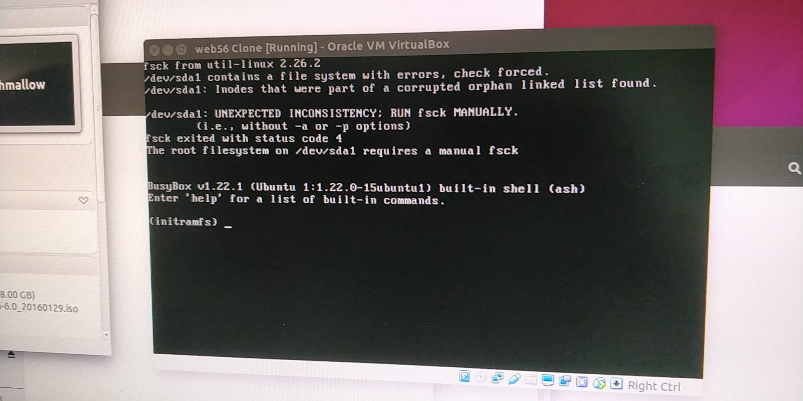

1. 
```
/dev/sda1 contains a file system with errors, check forced 
```



```
fsck -f /dev/sda1
```


1. [/dev/sda1 contains a file system with errors, check forced [duplicate]](https://askubuntu.com/a/955504)
2. [/dev/sda1: Inodes that were part of a corrupted orphan linked list found](https://askubuntu.com/a/948207)