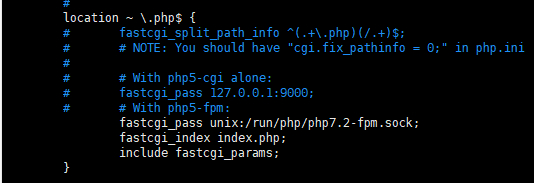

[TOC]

# Ubuntu LNMP #

1. 替换源

```
sudo cp /etc/apt/sources.list /etc/apt/sources.list.bak #备份
sudo vim /etc/apt/sources.list #修改
sudo apt-get update #更新列表
```

阿里云源

```
deb http://mirrors.aliyun.com/ubuntu/ trusty main restricted universe multiverse
deb http://mirrors.aliyun.com/ubuntu/ trusty-security main restricted universe multiverse
deb http://mirrors.aliyun.com/ubuntu/ trusty-updates main restricted universe multiverse
deb http://mirrors.aliyun.com/ubuntu/ trusty-proposed main restricted universe multiverse
deb http://mirrors.aliyun.com/ubuntu/ trusty-backports main restricted universe multiverse
deb-src http://mirrors.aliyun.com/ubuntu/ trusty main restricted universe multiverse
deb-src http://mirrors.aliyun.com/ubuntu/ trusty-security main restricted universe multiverse
deb-src http://mirrors.aliyun.com/ubuntu/ trusty-updates main restricted universe multiverse
deb-src http://mirrors.aliyun.com/ubuntu/ trusty-proposed main restricted universe multiverse
deb-src http://mirrors.aliyun.com/ubuntu/ trusty-backports main restricted universe multiverse
```

2. 更新ubuntu软件源

```
sudo apt-get update
```

3. 安装 nginx

```
sudo apt-get install nginx
```

4. 安装 mysql

```
sudo apt install mysql-server mysql-client
```

5. 安装php7.2


```
sudo apt-add-repository ppa:ondrej/php  ###使用 PPA ppa:ondrej/php
sudo apt update  ###更新软件库
sudo apt install php7.2 php7.2-fpm php7.2-cgi php7.2-common php7.2-curl php7.2-mysql  php7.2-mbstring php7.2-zip

sudo apt install unzip 
```


注: 若要安装其他版本php，则修改版本号就行


安装 php 7.2的mcrypt扩展

```
sudo apt install php7.2-dev libmcrypt-dev php-pear
sudo apt-get install php-xml php7.2-xml
sudo pecl channel-update pecl.php.net
sudo pecl install mcrypt-1.0.1
```

安装 mcrypt 成功之后，会提示类似以下的内容:

```
Build process completed successfully
Installing '/usr/lib/php/20170718/mcrypt.so'
install ok: channel://pecl.php.net/mcrypt-1.0.1
configuration option "php_ini" is not set to php.ini location
You should add "extension=mcrypt.so" to php.ini
```

6. nginx 配置

6.1 配置 fpm 配置

```
sudo vim /etc/php/7.2/fpm/pool.d/www.conf
```

```
#nginx 和fastcgi通信有2种方式，一种是TCP方式，还有种是UNIX Socket方式
#默认是socket方式
listen = /run/php/php7.2-fpm.sock
 
#TCP方式
#listen = 127.0.0.1:9000
```

```
#可以用如下方式检查下配置文件是否有错误
sudo php-fpm7.2 -t 

#修改重启下 php-fpm7.2
sudo service php-fpm7.2 restart
```

6.2 配置 nginx


```
sudo vim /etc/nginx/sites-enabled/default
```

编辑配置文件:

6.2.1 替换 root 路径

```
root /var/www;
```

6.2.2 添加 index.php

```
# Add index.php to the list if you are using PHP
index index.php index.html index.htm;
```

6.2.3 支持 php

找到 `location ~ \.php$`




这里使用socket 通信方式，fastcgi通信方式必须和php fpm中配置文件的listen一样

重启 nginx

```
sudo service nginx restart
```

nginx 检查配置文件命令是

```
sudo nginx -t
```

------

到此配置文件基本ok了，我们在/var/www目录下，新建个phpinfo.php测试下看看

```
<?php phpinfo();
```


安装 xdebug

```
git clone git://github.com/xdebug/xdebug.git
cd xdebug
phpize

sudo find / -name php-config
./configure --enable-xdebug --with-php-config=/usr/local/php/bin/php-config #按上面php-config查找到的路径进行替换

sudo make
sudo make install
```

将 xdebug扩展加入到 php.ini中

```
sudo find / -name php.ini
```


查找结果:

```
/etc/php/7.2/fpm/php.ini
/etc/php/7.2/cgi/php.ini
/etc/php/7.2/cli/php.ini
```

在 上面查找到的 php.ini 查找 `extension=`, 在后面添加

```
extension=mcrypt.so
zend_extension=xdebug.so
```


然后重启 php-fpm

```
sudo service php7.2-fpm restart
```


##### Reference #####
1. [Ubuntu 14.04 更换阿里云源](https://www.cnblogs.com/littlemonsters/p/5783690.html)

2. [Ubuntu16.04 快速搭建lnmp环境](https://www.cnblogs.com/zhangbobo/p/9597446.html)

3. [Ubuntu 16.04LTS LNMP环境配置](https://www.cnblogs.com/ddling/p/5906109.html)

4. [Install PHP 7.2-Mcrypt Module On Ubuntu 18.04 LTS](https://websiteforstudents.com/install-php-7-2-mcrypt-module-on-ubuntu-18-04-lts/)

5. [Error with PECL command in PHP7](https://serverfault.com/a/906186) fix PECL `Warning: Invalid argument supplied for foreach() in Command.php on line 249`

6. [Ubuntu系统下lnmp环境搭建和Nginx多站点配置](https://www.cnblogs.com/LO-gin/p/6032026.html) 看图片才知道 除 `fastcgi_pass` 项，下面的2个选项也要把注释去掉

# Laravel .env #

如果部署的Laravel项目，web 虚拟主目录不是指向 laravel项目中的 public, 就可以通过浏览器访问到 非 public目录下的文件，如 保护 .env 不被访问到

如web 服务器是用 apache,可以添加一个 .htaccess 在 项目根目录，内容如下:

```
# Disable index view
Options -Indexes

# Hide a specific file
<Files .env>
    Order allow,deny
    Deny from all
</Files>

```

# Certbotauto SSL Certificate  non-www domain and www domain

```
./certbot-auto certonly --server https://acme-v02.api.letsencrypt.org/directory --manual --preferred-challenges dns  -d example.com -d www.example.com
```

##### Reference
1. [SSL Certificate not working for non-www domain](https://community.letsencrypt.org/t/ssl-certificate-not-working-for-non-www-domain/62529)

# PHP Warning:  Xdebug MUST be loaded as a Zend extension in Unknown on line 0

```
extension=xdebug.so
```

to 

```
zend_extension=xdebug.so
```

##### Reference 
1. [PHP Warning: Xdebug MUST be loaded as a Zend extension](https://stackoverflow.com/a/26222131)