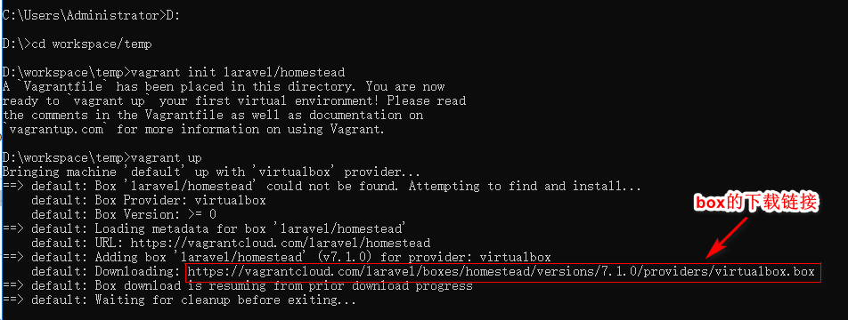
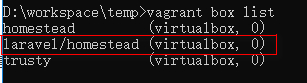

# Homestead 搭建

基础运行环境: win10 + vagrant + virtualbox + git


1. 下载 homestead的box [homestead](https://app.vagrantup.com/laravel/boxes/homestead) 

随意进入一个文件夹:

```cmd
cd D:
cd workspace/temp
vagrant init laravel/homestead
vagrant up
```


如果不需要homestead的box或者下载速度还可以的话，可以等待它启动完毕就可以。

因为我是想下载 homestead的box,然后再引入到本地的 vagrant box 列表中，在当命令运行到 可以看到下载 box的 url时，按"Ctrl" + "C" 键取消当前运行，然后复制这段 url在浏览器打开，应该就会开始下载了。 





2. 将 下载好的 homestead的box 引入到 vagrant box list中

如果在线安装好 homestead的，可跳过该步骤:

```cmd
vagrant box add laravel/homestead E:/vagrantbox/4c1719e9-652d-4392-bd91-69db902138ed.box
```
以上的box绝对路径和box名称按实际情况调整


```cmd
vagrant box list #查看本地所有已导入的 vagrant box
```



3. 下载 Homestead 管理

```cmd
D:
cd workspace/vagrant # 进入我自己电脑的 D:/workspace/vagrant 文件夹下
git clone https://github.com/laravel/homestead.git Homestead
cd Homestead
git checkout v8.2.0 # 切换到一个 tag
init.bat # linux下是 init.sh,如果 init.bat运行不到，可试运行 ./init.bat
```

4. 修改 `Homestead.yaml` 文件

修改 同步的文件夹和站点

```
folders:
    - map: D:/workspace/php/laravelproject1
      to: /home/vagrant/code/laravelproject1

sites:
    - map: homestead.test
      to: /home/vagrant/code/laravelproject1/public
```

5. 将 `Homestead.yaml` 中的 ip 放入到系统的host文件中

修改 `C:\Windows\System32\drivers\etc\hosts`, 添加

```
192.168.10.10 homestead.test
```

6. 启动vagrant中的虚拟机

通过上面的步骤，已经配置好 `Homestead.yaml` 文件和host 文件，在clone之后的 `Homestead` 目录下，运行 `vagrant up`命令 启动虚拟机；

启动完成之后，使用浏览器访问 `http://homestead.test`，应该就会显示 laravel的默认首页了


7. homestead的 mysql 默认用户名和密码:

username: homestead
password: secret

------

如果遇到这个提示:

```
Check your Homestead.yaml (or Homestead.json) file, the path to your private key does not exist.
```

可通过运行以下命令解决:

```
ssh-keygen -t rsa -b 4096 -C "your_email@example.com" 
eval "$(ssh-agent -s)"
ssh-add -k ~/.ssh/id_rsa
```


-----

vagrant box 已经加好了 homestead的box,但是启动还是会下载 box的解决方法

在 clone下来的 `Homestead` 文件夹下

修改 `Homestead\scripts\homestead.rb` 文件，将 `config.vm.box_version = settings["version"] ||= ">= 0.4.0"` 改为 `config.vm.box_version = settings["version"] ||= ">= 0"`

然后再 `vagrant up`


##### Reference

1.  [[ Laravel 5.6 文档 ] 快速入门 —— 重量级开发环境：Homestead](https://laravelacademy.org/post/8671.html)
2.  [已经安装'laravel/homestead' box，但是执行homestead up时提示找不到box，怎么办？](https://segmentfault.com/q/1010000004472813/a-1020000004506197)
3.  [Laravel China 5.5 文档 Homestead](https://learnku.com/docs/laravel/5.5/homestead/1285)

