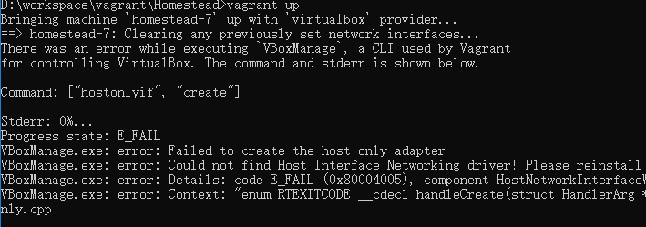

# win10 vagrant The command and stderr is shown below.  Command: ["hostonlyif", "create"]


```cmd
D:\workspace\vagrant\Homestead>vagrant up
Bringing machine 'homestead-7' up with 'virtualbox' provider...
==> homestead-7: Clearing any previously set network interfaces...
There was an error while executing `VBoxManage`, a CLI used by Vagrant
for controlling VirtualBox. The command and stderr is shown below.

Command: ["hostonlyif", "create"]

Stderr: 0%...
Progress state: E_FAIL
VBoxManage.exe: error: Failed to create the host-only adapter
VBoxManage.exe: error: Could not find Host Interface Networking driver! Please reinstall
VBoxManage.exe: error: Details: code E_FAIL (0x80004005), component HostNetworkInterfaceWrap, interface IHostNetworkInterface
VBoxManage.exe: error: Context: "enum RTEXITCODE __cdecl handleCreate(struct HandlerArg *)" at line 94 of file VBoxManageHostonly.cpp

```



我的處理方法是： 重裝virtualbox，然後再運行 vagrant up


##### Reference

1. [Windows 10 - Failed to create the host-only adapter](https://github.com/docker/machine/issues/2465)
2. ["Failed to create host network interface" on Windows 10](https://www.virtualbox.org/ticket/14545#comment:20)


