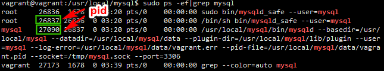

# Homestead 安装其它的PHP版本

运行环境:

系统: win10

软件: 

1. virtualbox 6.2
2. vagrant 2.2.4 
3. homestead 7.1.0 

```
sudo apt-get update
sudo apt-get -y install php5.6-mysql php5.6-fpm php5.6-mbstring php5.6-xml php5.6-curl
```

安装中出现
```
Fetched 3,466 kB in 6min 24s (9,022 B/s)                                                                                       
E: Failed to fetch http://ppa.launchpad.net/ondrej/php/ubuntu/pool/main/p/php5.6/php5.6-common_5.6.40-8+ubuntu18.04.1+deb.sury.org+1_amd64.deb  Connection timed out [IP: 91.189.95.83 80]
E: Unable to fetch some archives, maybe run apt-get update or try with --fix-missing?
```

这是因为下载超时导致的，继续执行

```
sudo apt-get -y install php5.6-mysql php5.6-fpm php5.6-mbstring php5.6-xml php5.6-curl
```

进行重试进行安装 php 5.6

最后执行命令，进行 重启 nginx和php5.6-fpm

```
/etc/init.d/nginx restart
/etc/init.d/php5.6-fpm restart
```

##### Reference

1. [How to update PHP version in homestead](https://stackoverflow.com/a/40103584)
2. [Cannot add PPA: 'ppa:ondrej/php5-5.6'](https://stackoverflow.com/a/40677790)


# Ubuntu 16.04 PHP5.6


安装 Apache + PHP 5.6 + mysql 5.5

系统: Ubuntu 16.04


1. 替换源

```
sudo cp /etc/apt/sources.list /etc/apt/source.list_bak
sudo vim /etc/apt/sources.list
```

阿里源:

```
# deb cdrom:[Ubuntu 16.04 LTS _Xenial Xerus_ - Release amd64 (20160420.1)]/ xenial main restricted
deb-src http://archive.ubuntu.com/ubuntu xenial main restricted #Added by software-properties
deb http://mirrors.aliyun.com/ubuntu/ xenial main restricted
deb-src http://mirrors.aliyun.com/ubuntu/ xenial main restricted multiverse universe #Added by software-properties
deb http://mirrors.aliyun.com/ubuntu/ xenial-updates main restricted
deb-src http://mirrors.aliyun.com/ubuntu/ xenial-updates main restricted multiverse universe #Added by software-properties
deb http://mirrors.aliyun.com/ubuntu/ xenial universe
deb http://mirrors.aliyun.com/ubuntu/ xenial-updates universe
deb http://mirrors.aliyun.com/ubuntu/ xenial multiverse
deb http://mirrors.aliyun.com/ubuntu/ xenial-updates multiverse
deb http://mirrors.aliyun.com/ubuntu/ xenial-backports main restricted universe multiverse
deb-src http://mirrors.aliyun.com/ubuntu/ xenial-backports main restricted universe multiverse #Added by software-properties
deb http://archive.canonical.com/ubuntu xenial partner
deb-src http://archive.canonical.com/ubuntu xenial partner
deb http://mirrors.aliyun.com/ubuntu/ xenial-security main restricted
deb-src http://mirrors.aliyun.com/ubuntu/ xenial-security main restricted multiverse universe #Added by software-properties
deb http://mirrors.aliyun.com/ubuntu/ xenial-security universe
deb http://mirrors.aliyun.com/ubuntu/ xenial-security multiverse
```

2. 安装 apache2

```
sudo apt-get install apache2
```

3. 安装 php 5.6

```
sudo apt-get install python-software-properties
sudo apt-get install software-properties-common
sudo apt-get update

sudo add-apt-repository ppa:ondrej/php
sudo apt-get update
sudo apt-get -y install libapache2-mod-php5.6 php5.6 php5.6-mcrypt php5.6-mbstring php5.6-curl php5.6-cli php5.6-mysql php5.6-gd php5.6-intl php5.6-xsl php5.6-zip
```

国内安装时可能会比较慢，需要耐心的等待


4. 安装mysql-client,mysql-server

如果安装 mysql 5.7，可直接使用以下命令进行安装

```
sudo apt-get install mysql-server mysql-client
```
安装过程中，会跳出 输入mysql `root` 用户的密码的界面

------

我尝试安装的是mysql 5.5.31 版本

4.1. 进入`/tmp`目录，下载mysql 5.5.31

```
cd /tmp
wget https://cdn.mysql.com/archives/mysql-5.5/mysql-5.5.31-linux2.6-x86_64.tar.gz


```
4.2. 添加用户组

```
sudo groupadd mysql 
sudo useradd -r -g mysql mysql
```

4.3. 将压缩包文件`mysql-5.5.31-linux2.6-x86_64.tar.gz`解压到`/usr/local`文件夹下

```
sudo tar zxvf ./mysql-5.5.31-linux2.6-x86_64.tar.gz -C /usr/local
```

4.4. 将文件夹名称`mysql-5.5.31-linux2.6-x86_64`重命名为`mysql`

```
cd /usr/local
sudo mv mysql-5.5.31-linux2.6-x86_64 mysql
```

4.5. 设定 mysql 文件夹的拥有者和用户组

```
cd mysql
sudo chown -R mysql:mysql *
```

4.6. 安装依赖包(5.6版本也适用)

```
sudo apt-get install libaio1
```

4.7. 执行mysql安装脚本

```
sudo scripts/mysql_install_db --user=mysql
```

执行之后是

```
vagrant@vagrant:/usr/local/mysql$ sudo scripts/mysql_install_db --user=mysql
Installing MySQL system tables...
OK
Filling help tables...
OK

To start mysqld at boot time you have to copy
support-files/mysql.server to the right place for your system

PLEASE REMEMBER TO SET A PASSWORD FOR THE MySQL root USER !
To do so, start the server, then issue the following commands:

./bin/mysqladmin -u root password 'new-password'
./bin/mysqladmin -u root -h vagrant password 'new-password'

Alternatively you can run:
./bin/mysql_secure_installation

which will also give you the option of removing the test
databases and anonymous user created by default.  This is
strongly recommended for production servers.

See the manual for more instructions.

You can start the MySQL daemon with:
cd . ; ./bin/mysqld_safe &

You can test the MySQL daemon with mysql-test-run.pl
cd ./mysql-test ; perl mysql-test-run.pl

Please report any problems with the ./bin/mysqlbug script!

```

4.8. 设置`mysql`文件夹内的文件拥有者和 mysql 文件夹目录的拥有者一样

```
sudo chown -R root .
```

4.9. 设置`data`文件夹的拥有者和里面文件的文件夹拥有者一样

```
sudo chown -R mysql data
```

4.10. 复制 mysql的配置文件

```
sudo cp support-files/my-medium.cnf /etc/my.cnf #mysql 5.5
sudo cp support-files/my-default.cnf /etc/my.cnf #mysl 5.6
```

4.11. 启动mysql 

```
sudo cp support-files/mysql.server /etc/init.d/mysql.server
sudo bin/mysqld_safe --user=mysql &
```

4.12. 初始化 root 用户的密码

```
sudo bin/mysqladmin -u root password '[your new password]'
```
如:
```
sudo bin/mysqladmin -u root password 'secret'
```

4.13. 设置mysql命令的软连接

```
sudo ln -s /usr/local/mysql/bin/mysql /usr/local/bin/mysql
```

4.14.  停止mysqld_safe 或者直接重启(忽略本小节的命令)

停止刚才的 mysqld_safe
```
sudo ps -ef|grep mysql
```



```
sudo kill -9 26837
sudo kill -9 27090
```

4.15  设置mysql开机自启动

```
sudo update-rc.d -f mysql.server defaults 
```

如果不想mysql开机自启动(可选)

```
sudo update-rc.d -f mysql.server remove
```

4.16. 启动mysql

```
sudo /etc/init.d/mysql.server start #sudo service mysql start
```

4.17 停止mysql

```
sudo /etc/init.d/mysql.server stop #sudo service mysql stop
```

4.18 查看 mysql 运行状态

```
sudo /etc/init.d/mysql.server status #sudo service mysql status
```


5. 设置 mysql的 sql_model

编辑 `/etc/mysql.cnf`,在文件内容的末尾添加

```
[mysqld]
sql_mode=STRICT_TRANS_TABLES,NO_ZERO_IN_DATE,NO_ZERO_DATE,ERROR_FOR_DIVISION_BY_ZERO,NO_AUTO_CREATE_USER,NO_ENGINE_SUBSTITUTION
max_allowed_packet=100M
```


注: 如果需要 mysql中的 date 和datetime可以为 `0000-00-00 00:00:00`的格式的话，需要将上面的 `NO_ZERO_IN_DATE,NO_ZERO_DATE` 移除掉


避免出现 `#3065 - Expression #1 of ORDER BY clause is not in SELECT list` 这样的错误提示

----

新建的用户，如果遇到无法登入的情况，如登入时，提示`ERROR 1045 (28000): Access denied for user`,可能是密码输入不正确，通过重新修改这个用户的密码的方式进行处理

先使用root用户登入入到mysql命令行中;

```
mysql -u root -p #回车之后，输入root用户的密码
update mysql.user set password=PASSWORD('root') where User='root'; # mysql 5.5以前版本
UPDATE mysql.user SET authentication_string=PASSWORD('root') WHERE USER='root'; $ mysql 5.6以后的命令
FLUSH PRIVILEGES; #刷新数据库。
quit; #退出
```


##### Reference

1. [Ubuntu 16.04 几个国内更新源](https://www.cnblogs.com/bovenson/p/5752213.html)
2. [ubuntu16.04安装php5](https://www.cnblogs.com/yxhblogs/p/5842568.html)
3. [Cannot add PPA: 'ppa:ondrej/php5-5.6'](https://stackoverflow.com/a/40677790)
4. [MySQL 5.7 以上版本默认禁止 0000-00-00 的日期](https://www.cnblogs.com/dannyyao/p/8126193.html)
5. [如何下载旧版本的MySQL](https://www.cnblogs.com/EasonJim/p/7147134.html) 学习到如何在mysql官网中找旧版本的mysql进行下载
6. [How to install mysql 5.5 or 5.6 on ubuntu 16.04 xenial](https://www.processio.com/install-mysql-5-5-5-6-ubuntu-16-04-xenial/) 参考安装mysql 5.5
7. [Ubuntu16.04下通过tar.gz包安装MySQL5.5.52](https://www.cnblogs.com/Mvloveyouforever/p/9949539.html) 参考安装mysql 5.5
8. [【MySQL】ERROR 1045 (28000): Access denied for user的解决方法](https://www.cnblogs.com/playcode/p/5646206.html)