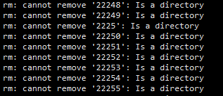

# Linxu執行 rm -rf Argument list too long

因爲docker容器中跑的Jenkins 有1個任務是名称叫`Jenkins Update`总是失败，而且定时是`* * * * *`每分钟执行的，导致文件夹`jobs`文件夹过多

参考文章的第1篇中，了解到，可以使用`awk`工具进行处理

进入需要删除的文件夹中,然后删除里面的`文件`

```
cd /home/vagrant/test
ls -l| awk '{ print "rm -f ",$9}'|sh
```



因为Jenkins的`builds`下是数字名称的文件夹，所以命令需要修改一下

```
cd ~/docker/jenkins/jobs/Jenkins Update/builds
ls -l| awk '$9<=120254{ print "sudo rm -rf ",$9}'|sh
```


`$9` 是 `ls -l` 第9列，因为我的文件夹是 以数字命名的名称，所以加了数字的判断 

##### Reference
1. [Linux下通过 rm -f 删除大量文件时报错：Argument list too long](https://www.cnblogs.com/-abm/p/9283896.html)
2. [awk从放弃到入门（1）：awk基础 （通俗易懂，快进来看](https://blog.csdn.net/liang5603/article/details/80855386)
3. [一. AWK入门指南](https://awk.readthedocs.io/en/latest/chapter-one.html)
4. [awk实战：文件里面全是数字，实现大于100的求和并打印出所在行和这些数字的总和](https://blog.51cto.com/chaorenhuifei/1704339)

# Docker 安装  portainer

dockerhub上的 [portainer/portainer](https://hub.docker.com/r/portainer/portainer)

1. 拉取镜像

```
sudo docker pull portainer/portainer
```
2. 运行创建portainer

```
sudo docker run -d -p 9000:9000 \
    --restart=always \
    -v /var/run/docker.sock:/var/run/docker.sock \
    --name ptest portainer/portainer
```

就可以通过浏览器访问 `http://ip:9000` 进入管理页面。初次启动需要选择 `EndPoints`和设置`admin`的密码。
因为我是单机运行的docker,所以`EndPoints`选择的 `Local`


```
sudo docker exec -it containerName /bin/bash #使用exec命令 进入容器中的ssh,containerName是容器名称
sudo docker start containerName #根据容器名称启动一个容器
sudo docker stop containerName #根据容器名称停止一个容器
sudo docker restart containnerName #根据容器名称重启一个容器
```


##### Reference

1. [Docker 部署 portainer](https://www.cnblogs.com/xiangsikai/p/10291643.html)
2. [Docker容器的创建、启动、和停止](https://www.cnblogs.com/linjiqin/p/8608975.html)
3. [Portainer快速使用](https://www.kancloud.cn/websoft9/docker-guide/828253)