# Cacti 发送警告邮件

Cacti版本: 0.8.8a

目的:监听CPU 高于1个设定值时发送警告邮件(范例这一台主机有1颗实体CPU，总共2核心)


1. 需要安装的插件:
1.1. [thold](https://docs.cacti.net/plugin:thold)  Threshold，下载使用的是`v0.5.0`版本
1.2. [Settings](https://docs.cacti.net/plugin:settings)  应该是主要用于发送邮件的,下载使用的是`v0.71-1`版本

将解压后的文件夹复制放入到 cacti根目录的`plugins` 文件夹中

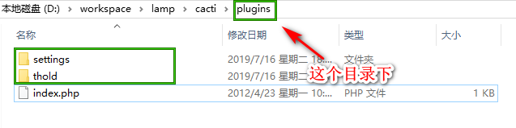

2. 通过插件管理启用 安装的插件

菜单 : `console` -> `Plugin Management`

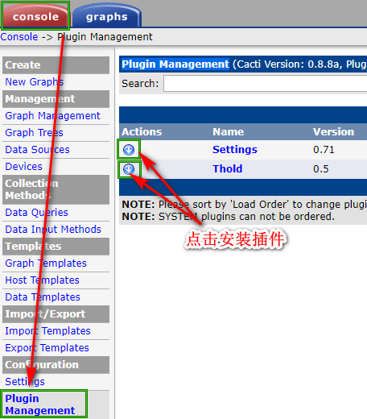

然后再点击 "->" 箭头的图片，启用插件

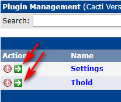

3. 设置发送邮件信息

3.1 通过 菜单 `Console` -> `Settings` 页面下的 `Mail / DNS`选项卡 设置发送电邮信息

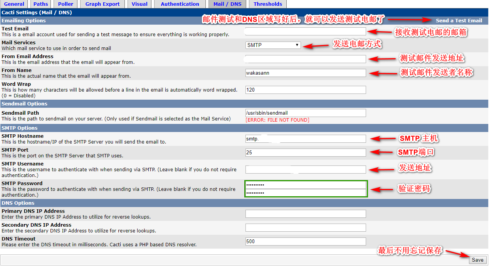

看参考的文章，是使用163的SMTP,`DNS Options`有填写

Primary DNS IP Address: 202.106.0.20
Secondary DNS IP Address: 202.106.46.151

但是我没有填写 DNS Options，也可以发送到 测试邮件和警告邮件

测试发送邮件

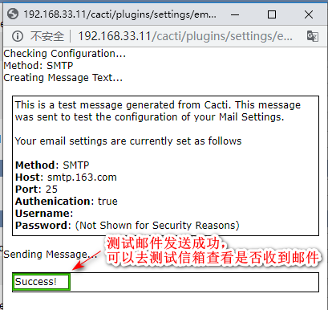

3.2 设置发送警告的发送地址和发送方名称

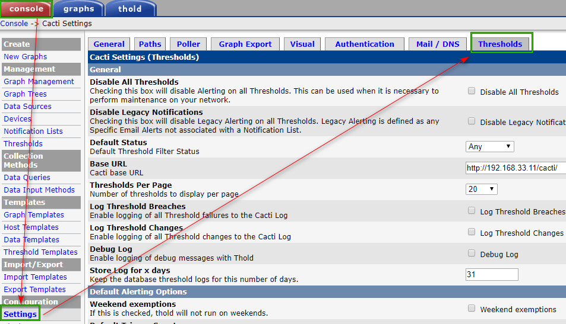


4. 添加 Threshold Management 


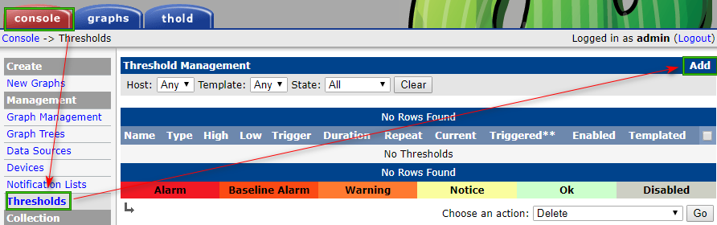

进入 Threshold Management  向导


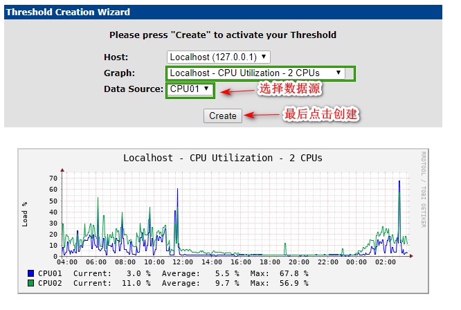


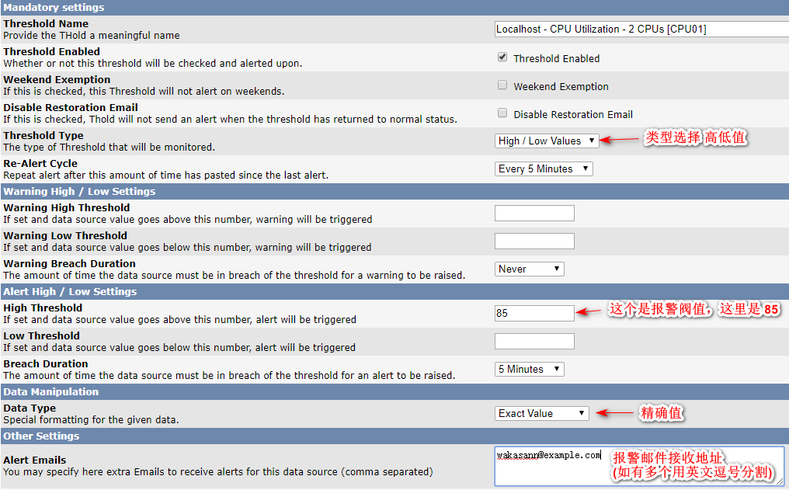

最后不用忘记保存哦

这里是当 CPU01 的值 大于等于 85 时就发送警告邮件

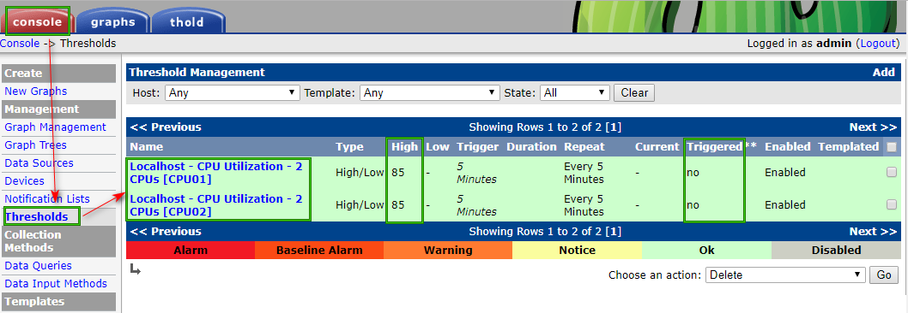

因为是2核的CPU,所以按照相同的方法创建了监听 CPU02 的

如果需要测试是否会发送警告邮件，可以将 阀值 的值设定的小一些，让警告能够触发到，然后在 警告邮件接收地址里面，查看 警告邮件。测试完成之后，再改回 自己设定过的发送警告的阀值。


##### References
1. [Cacti 流量监控全步骤、邮件报警实现过程](https://blog.csdn.net/redhat_xiaoguaishou/article/details/19335581)
2. [cacti报警邮件的设置](https://www.cnblogs.com/xzlive/p/10578140.html)
3. [cacti安装记录 第四阶段cacti的基本使用（3）setting and thresholds （邮件和阀值报警）](https://blog.csdn.net/xdnabl/article/details/51273395)

# Cacti 添加 CPU 监听

1. 將 [http://forums.cacti.net/about29832-0-asc-135.html](http://forums.cacti.net/about29832-0-asc-135.html) 网址的template下载，有1,2,4,8,12,16核心的template及script抓下來，并将 `host_mib_cpu.sh` 复制到 cacti 根目录下的`scripts` 文件夹中

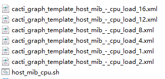

2. 將template.xml 导入到cacti 主机，连上webe 管理界面，选择[Import Templates]


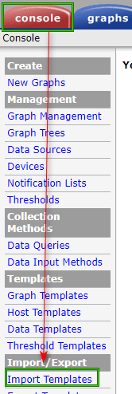

將下载的template都导入 => 点选浏览选择档案 => 右下方 [Import]

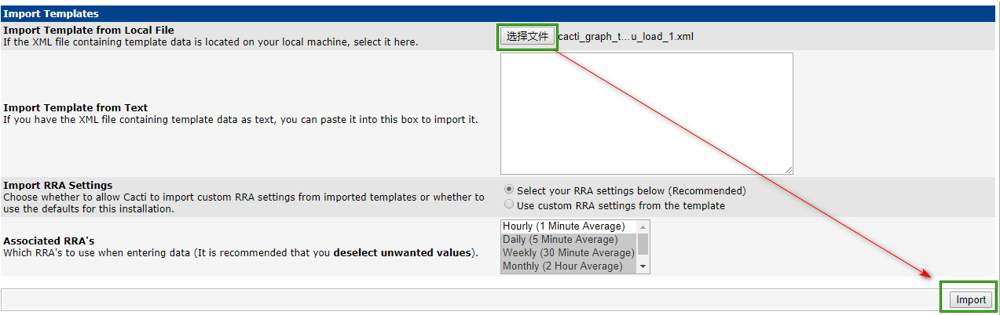

导入后再到 Data Templates 页面，可看到如下图

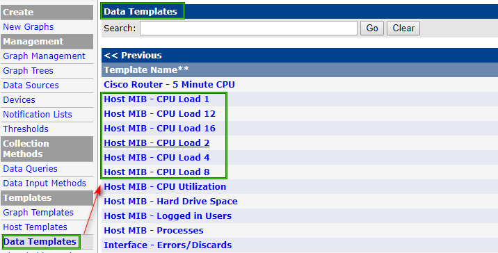

Graph Templates 会看到如下图:

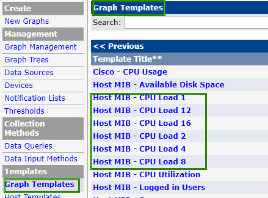

制作多核心cpu使用率图表

在Management > devices > 找到要制作的主机 (范例这一台主机有1颗实体CPU，总共2核心)

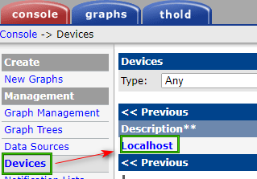


在[Associated Graph Templates] 选择 [Host MIB-CPU Load 2] 点选 Add


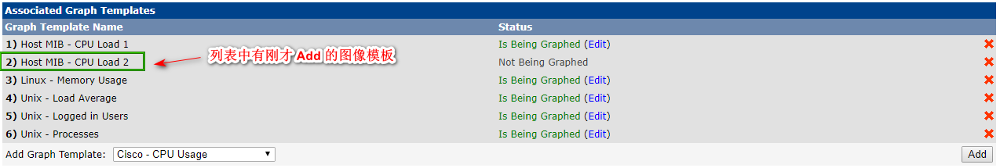

然后回到当前页面头部，点击 [Create Graphs for this Host ]

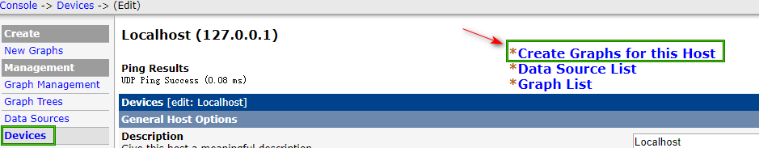

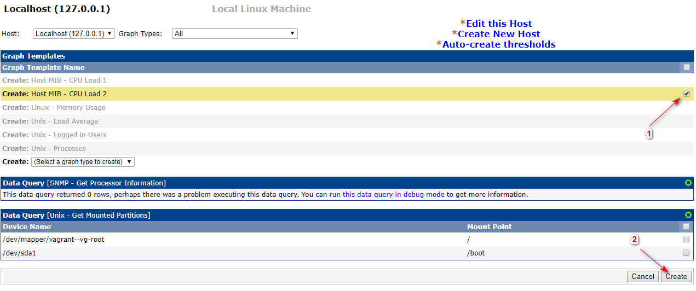

建立完毕后，点选 Graph Management 后，选择该台主机，应该就會看到XXX-CPU Utilization – 2CPU

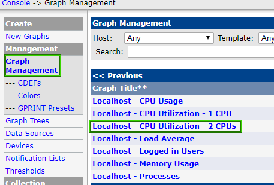

点选之后，可以看到该资讯每個cpu core 使用率整合在一张图表

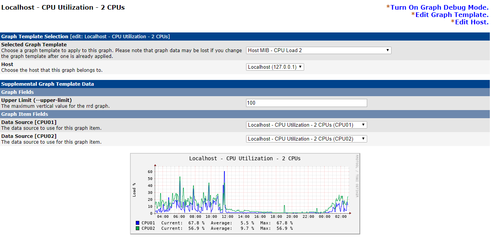

------

其它备忘:

```
sudo cp /etc/snmp/snmpd.conf /etc/snmp/snmpd.conf.bak
sudo vim /etc/snmp/snmpd.conf
sudo service snmpd restart
snmpbulkwalk -c public -v 2c 127.0.0.1
```

```
snmpd -v # 查看当前的snmp版本
```

snmpd.conf

版本 5.5 的 `snmpd.conf`

```
####
# First, map the community name "public" into a "security name"

#       sec.name  source          community
#com2sec notConfigUser  default       public
# i changed at below 1 line
com2sec notConfigUser 127.0.0.1 public
####
# Second, map the security name into a group name:

#       groupName      securityModel securityName
group   notConfigGroup v1           notConfigUser
group   notConfigGroup v2c           notConfigUser

####
# Third, create a view for us to let the group have rights to:

# Make at least  snmpwalk -v 1 localhost -c public system fast again.
#       name           incl/excl     subtree         mask(optional)
view    systemview    included   .1.3.6.1.2.1.1
view    systemview    included   .1.3.6.1.2.1.25.1.1
# i changed at below 1 line
view    systemview    included   .1
####
# Finally, grant the group read-only access to the systemview view.

#       group          context sec.model sec.level prefix read   write  notif
#access  notConfigGroup ""      any       noauth    exact  systemview none none
# i changed
access  notConfigGroup ""      any       noauth    exact  all        none none

#view all    included  .1                               80
# i changed
view all    included  .1  80
```


版本 5.7.3 的 `snmpd.conf`

```
                                                 #  system + hrSystem groups only
view   systemonly  included   .1.3.6.1.2.1.1
view   systemonly  included   .1.3.6.1.2.1.25.1
# i add 2 line at blow 
view   systemonly  included   .1 80
view   systemview  included   .1
```


##### References
1. [CentOS 7-Cacti 0.8.8g 多核心CPU使用率整合一張圖表顯示](https://blog.pmail.idv.tw/?p=13648) 转载的主文


