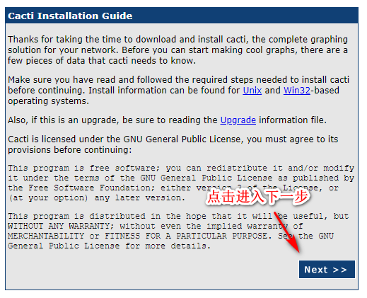
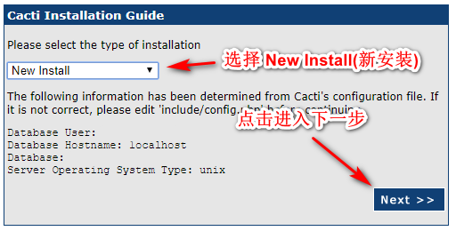
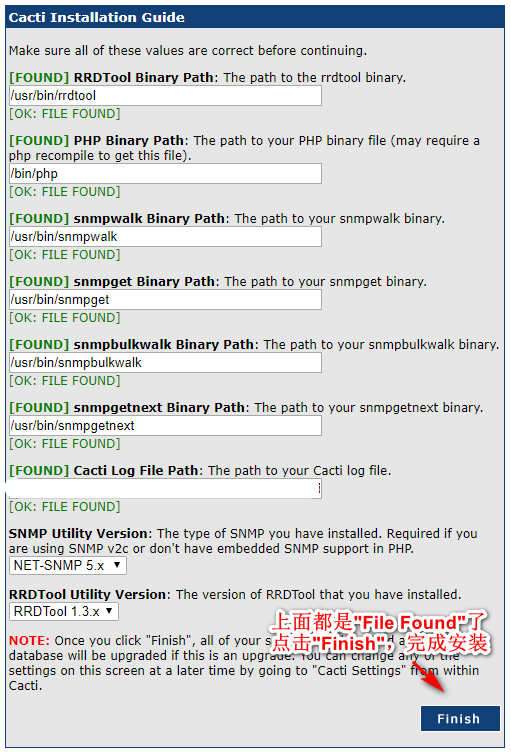
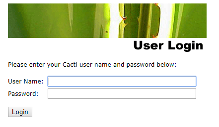
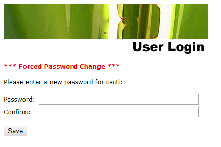

# php 连接mysql 主机 localhost，显示 No such file or directory

打开 `php.ini`文件，找到这1行

```
mysql.default_socket
```

然后将它修改为

```
mysql.default_socket=/path/to/mysql.sock
```

`/path/to/mysql.sock`是mysql的配置文件`/etc/my.cnf`中的`socket`的路径

如我当前虚拟机中的mysql 配置文件`/etc/my.cnf`的`socket = /tmp/mysql.sock`,所以修改`php.ini`中找到的`mysql.default_socket = `都改为`mysql.default_socket = /tmp/mysql.sock`，然后重启 apache，使配置生效

-------

系统:Ubuntu 16.04
环境: Apache 2.4 + PHP 5.6.40 + Mysql 5.5.31

php连接mysql demo代码:

```
$conn = mysql_connect('localhost','root','secret');

if(!$conn){
	die(mysql_error());
}

echo "success";	
```

主机使用`localhost`，显示`No such file or directory`的错误。改为`127.0.0.1`之后可以连接成功。

前提: 我的mysql配置文件 `/etc/my.cnf`中`[mysqld]`节点下的配置项 `socket = /tmp/mysql.sock`

终端命令(用来查看 php 信息中`mysql.default_socket`的配置情况):

```
php -i | grep mysql.default_socket
```

运行结果:

```
mysql.default_socket => no value => no value
pdo_mysql.default_socket => /var/run/mysqld/mysqld.sock => /var/run/mysqld/mysqld.sock
```

php.ini中`mysql.default_socket`的默认路径和当前运行mysql 配置文件中的`socket`的值`/tmp/mysql.sock` 不相等

我的LAMP环境中`php.ini`文件有2个，路径分别是:`/etc/php/5.6/cli/php.ini`和`/etc/php/5.6/apache2/php.ini`

将上面2个`php.ini`文件中`mysql.default_socket = ` 都修改成`mysql.default_socket = /tmp/mysql.sock`，然后重启apache2

终端命令:

```
sudo service apache2 stop # 停止apache
sudo service apache2 start # 启动apache
```

再次查看 `mysql.default_socket`的配置是否生效

终端命令:

```
php -i | grep mysql.default_socket
```

运行结果:

```
mysql.default_socket => /tmp/mysql.sock => /tmp/mysql.sock
pdo_mysql.default_socket => /tmp/mysql.sock => /tmp/mysql.sock
```

配置成功，然后通过浏览器，访问带有上面 `php连接mysql demo代码`的文件，运行结果为`success`.


##### Reference 
1. [MySQL connection not working: 2002 No such file or directory](https://stackoverflow.com/a/1676741)


# Ubuntu 16.04 安装docker-ce,docker-compose

[Get Docker CE for Ubuntu](https://docs.docker.com/install/linux/docker-ce/ubuntu/)

####  卸载旧版本

```
sudo apt-get remove docker docker-engine docker.io containerd runc
```
#### 使用仓库方式的方法安装

1. 更新`apt`包的索引

```
sudo apt-get update
```

2. 安装包让`apt`可以使用https

```
sudo apt-get install \
    apt-transport-https \
    ca-certificates \
    curl \
    gnupg-agent \
    software-properties-common
```

3. 添加 docker 官方的GPG key:

```
curl -fsSL https://download.docker.com/linux/ubuntu/gpg | sudo apt-key add -
```
通过搜索密钥指纹的后8位来验证你现在的密钥指纹有`9DC8 5822 9FC7 DD38 854A E2D8 8D81 803C 0EBF CD88`

```
$ sudo apt-key fingerprint 0EBFCD88
pub   4096R/0EBFCD88 2017-02-22
      Key fingerprint = 9DC8 5822 9FC7 DD38 854A  E2D8 8D81 803C 0EBF CD88
uid                  Docker Release (CE deb) <docker@docker.com>
sub   4096R/F273FCD8 2017-02-22
```

4. 通过下面的命令设置一个`stable`(稳定的)仓库。

```
sudo add-apt-repository \
   "deb [arch=amd64] https://download.docker.com/linux/ubuntu \
   $(lsb_release -cs) \
   stable"
```

#### 安装docker ce

1. 更新`apt`包索引

```
sudo apt-get update
```

2. 安装最后版本的 Docker ce 和 containerd。

```
sudo apt-get install docker-ce docker-ce-cli containerd.io
```


##### references
1. [Get Docker CE for Ubuntu](https://docs.docker.com/install/linux/docker-ce/ubuntu/)
2. [Install Docker Compose](https://docs.docker.com/compose/install/)
3. [Ubuntu16.04 安装 Docke r及 docker-compose](https://blog.csdn.net/diligent_lee/article/details/79098302)


# 了解linux 检测工具

1. zabbix
2. cacti
3. Nagios 本想安装的，但是安装需要一个 空的服务器，因为服务器已经有安装 LAMP，故没有去了解

尝试了 cacti ,因为本地环境版本问题，只能使用`0.8.8a`版本，并且出现 配置的php等路径之后，cacti 显示`[ERROR: FILE NOT FOUND]`

rrdtool
centos

```
sudo yum install rrdtool librrd-dev
```

ubuntu:

```
sudo apt-get install rrdtool librrd-dev
```


1. centos 6.10 尝试cacti

因虚拟机已经安装好 php 5.6.40,mysql 5.5.31，因为php和mysql的版本比较低，故选择了`cacti-0.8.8a`版本进行安装

```
mysql -u root -p # 进入mysql终端
```

sql(创建cacti)

```
create database cacti default character set utf8; #创建cacti数据库
grant all on cacti.* to cacti@localhost identified by 'asd123'; #创建cacti用户，密码为 asd123,并赋予 cacti数据库的所有权限给cacti用户
 GRANT SELECT ON mysql.time_zone_name TO cacti@localhost IDENTIFIED BY 'cactiwhsir';
grant all on cacti.* to cacti@localhost identified by 'asd123';
flush privileges;
```

```
yum -y install net-snmp net-snmp-utils
yum -y install rrdtool rrdtool-devel

useradd cacti
useradd -M -s /sbin/nologin cacti
wget https://www.cacti.net/downloads/cacti-0.8.8a.zip
tar zxvf cacti-0.8.8a.tar.gz
mv cacti-0.8.8a cacti
chown -R cacti.cacti ./cacti
cd cacti
vim include/config.php # 修改数据库配置配置文件
```

```
$database_type = "mysql";
$database_default = "cacti"; //数据库名称
$database_hostname = "localhost";
$database_username = "cacti"; //数据库用户名
$database_password = "asd123"; //数据库用户密码
$database_port = "3306";
$database_ssl = false;
```


```
mysql -u cacti -p cacti < cacti.sql #导入cacti文件下的cacti.sql到cacti数据库
cd ..
chown -R root:root cacti
```

通过浏览器访问`http://ip/cacti` 就会跳入安装页面







会跳到登入页面，默认用户名和密码都是 `admin`



首次登录成功，会跳到修改`admin`用户的密码页面,重复输入两次新密码，点击"Save" 就安装完成了。



在 linux系统中，添加 crontab 任务,每1分钟执行一次`poller.php`

```
crontab -e
```

在打开文件的内容末尾添加:

```
*/1 * * * * /usr/bin/php /var/www/html/cacti/poller.php > /dev/null
```

然后保存退出，使用 `sudo service cron restart` 重启 cron服务


如果运行`snmpwalk -c public -v 2c 127.0.0.1`出现:

```
SNMPv2-SMI::mib-2 = No more variables left in this MIB View (It is past the end of the MIB tree)

snmpwalk -v 2c -c public 127.0.0.1 1.3.6.1.2.1.25.3.2.1
```

是snmpd.conf配置文件中配置出现问题,修改了 snmpd.conf文件，需要重启snmpd服务 `sudo service snmpd restart`


##### references
1. [ubuntu16.04安装python-rrdtool](https://blog.51cto.com/12674335/2152871)
2. [详解zabbix安装部署（Server端篇）](http://blog.chinaunix.net/uid-25266990-id-3380929.html)
3. [zabbix agent的主动模式与被动模式及zabbix proxy](https://www.jianshu.com/p/c735e9bb1c66)
4. [mysql性能监控工具：mycheckpoint的使用方法](https://www.cnblogs.com/ToDoToTry/p/4394249.html) 知道其它的工具
5. [监控三剑客<cacti、nagios、zabbix>](https://blog.51cto.com/13645280/2165369) 尝试了 cacti
6. [zabbix监控进程的CPU和内存占用量](https://blog.51cto.com/xianglinhu/1657570)
7. [mysql性能监控相关](https://my.oschina.net/dlpinghailinfeng/blog/170068) 知道其它监控工具
8. [Zabbix 3.0 从入门到精通(zabbix使用详解)](https://www.cnblogs.com/clsn/p/7885990.html)
9. [Cacti不显示图片(nan)](https://www.cnblogs.com/oskb/p/5532297.html)  学习配置snmpd
10. [CentOS 7-Cacti 0.8.8g 多核心CPU使用率整合一張圖表顯示](https://blog.pmail.idv.tw/?p=13648) 安装了cacti cpu多个核心的模板和sh文件，将sh文件放入到 cacti项目的`scripts`文件夹就可以
11. [CentOS 查看系统 CPU 个数、核心数、线程数](https://www.cnblogs.com/hapday/p/6336905.html)
12. [Cacti 監測 MySQL 伺服器](https://www.opencli.com/linux/cacti-monitoring-mysql-server) cacti 添加监听mysql