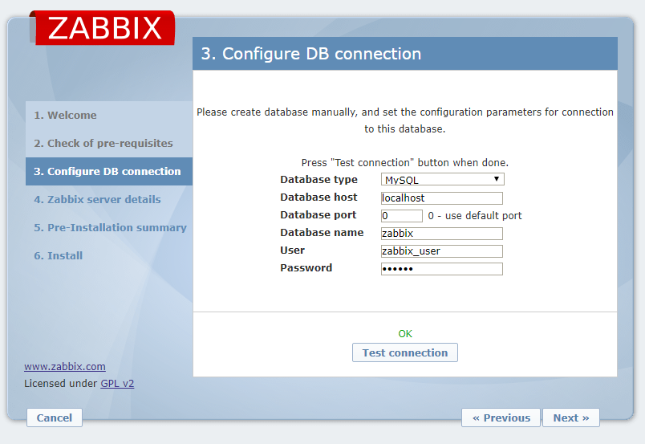
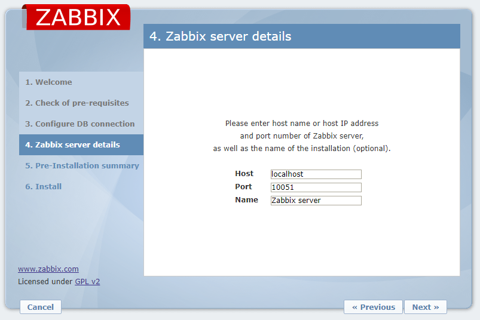
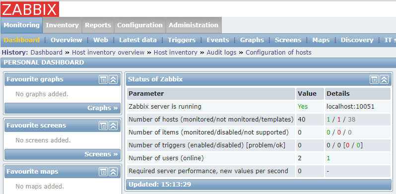

# cacti ERROR: FILE NOT FOUND

cacti 中paths的文件都在，但是还是提示`ERROR: FILE NOT FOUND`。

参考1的博文，是 `php.ini` 中打开了`open_basedir`，受这个配置的影响

打开`php.ini`文件，在`open_basedir` 前加`;` 进行注释，然后重启apache,再刷新 cacti 设置的路径页面，就会变成绿色的了。


httpd.conf中vhost中包含的

```
php_admin_flag engine ON
php_admin_value open_basedir /var/www/html/:/tmp:/var/tmp
```

##### References
1. [ltmp、lnmp下运行cacti监控path显示ERROR: FILE NOT FOUND](https://www.xiaohuai.com/4784)
2. [PHP绕过open_basedir限制操作文件的方法](https://www.jb51.net/article/141767.htm)
3. [open_basedir php授权目录设置](https://www.cnblogs.com/guohong-hu/p/9350076.html)


# Centos6 安装完之后，没有网络

Virtualbox安装的centos 6.10的虚拟机，安装时，网络是`NAT网络`，安装完之后，将网络改为`桥接网卡`，启动虚拟机之后，使用 `ifconfig` 命令查看没有到`eth0`的信息，只有`127.0.0.1`

编辑`/etc/sysconfig/network-scripts/ifcfg-eth0`文件

使用 `vi` 打开文件

```
vi /etc/sysconfig/network-scripts/ifcfg-eth0
```

我的`ifcfg-eth0` 文件的配置

```
DEVICE=eth0
HWADDR=08:00:27:3C:B5:84
TYPE=Ethernet
UUID=3e27d94d-9032-455f-b661-c050630df859
ONBOOT=yes # 只修动此处,将原先的no改为yes
NM_CONTROLLED=yes
BOOTPROTO=dhcp
```

然后重启网络

```
/etc/init.d/network restart #重启网络
ifconfig # 查看ip
```

##### References

1. [解决CentOS 6.5 安装之没有网络的问题 【转自云栖社区】](https://blog.csdn.net/gd6863/article/details/78513255)

# Centos yum的源 设置为阿里云源

在 [阿里巴巴镜像站页面](https://opsx.alibaba.com/mirror?lang=zh-CN)，在`centos` 操作的帮助，有介绍 `wget`和`curl` 2种方式来下载`CentOS-Base.repo`

1. 备份
```
mv /etc/yum.repos.d/CentOS-Base.repo /etc/yum.repos.d/CentOS-Base.repo.backup
```

2. 下载新的CentOS-Base.repo 到/etc/yum.repos.d/

2.1.  CentOS-Base.repo 在阿里巴巴镜像站的链接

CentOS 5: `http://mirrors.aliyun.com/repo/Centos-5.repo`
CentOS 6: `http://mirrors.aliyun.com/repo/Centos-6.repo`
CentOS 7: ` http://mirrors.aliyun.com/repo/Centos-7.repo`

使用 wget 软件进行下载

```
wget -O /etc/yum.repos.d/CentOS-Base.repo http://mirrors.aliyun.com/repo/Centos-5.repo #CentOS 5
wget -O /etc/yum.repos.d/CentOS-Base.repo http://mirrors.aliyun.com/repo/Centos-6.repo #CentOS 6
wget -O /etc/yum.repos.d/CentOS-Base.repo http://mirrors.aliyun.com/repo/Centos-7.repo #CentOS 7
```

或者使用 curl 软件进行下载

```
curl -o /etc/yum.repos.d/CentOS-Base.repo http://mirrors.aliyun.com/repo/Centos-5.repo #CentOS 5
curl -o /etc/yum.repos.d/CentOS-Base.repo http://mirrors.aliyun.com/repo/Centos-6.repo #CentOS 6
curl -o /etc/yum.repos.d/CentOS-Base.repo http://mirrors.aliyun.com/repo/Centos-7.repo #CentOS 7
```

或者直接下载 对应版本的`CentOS-Base.repo`文件,在本地使用编辑器打开，将本地打开的`CentOS-Base.repo`文件所有内容都复制到 centos的`/etc/yum.repos.d/CentOS-Base.repo`文件中去

3. 运行 `yum makecache` 命令生成缓存

##### References
1. [阿里巴巴镜像站页面](https://opsx.alibaba.com/mirror?lang=zh-CN) 点击列表的`centos`行的操作列，点击"帮助" 就会弹出设置教程咧


# zabbix

server : Ubuntu 16.04
zabbix-2.2.23

```
sudo apt-get install curl gcc make php-gd php-mysql php-bcmath php-mbstring php-xml snmp php-curl libcurl3 libcurl4-openssl-dev
```

```
sudo apt-get install apache2 mysql-server mysql-client
sudo apt-get install php php-mysql libapache2-mod-php
sudo apt-get install php-gd php-gmp
sudo apt-get install phpmyadmin
```

进入mysql,添加本地数据库使用的`zabbix_user`

```
use mysql;
create database zabbix character set utf8;
grant all privileges on zabbix.* to zabbix_user@'localhost' identified by '123456';
```

官网下载解压软件包。[下载地址](https://www.zabbix.com/download_sources#tab:22LTS)

下载的是源码包`souces`

进入到放zabbix-2.2.23.tar.gz的文件夹

```
tar -zxvf zabbix-2.2.23.tar.gz #解压文件
cd zabbix-2.2.23
tar -zxvf zabbix-2.2.23.tar.gz
```

导入数据库表


终端命令:

```
mysql -u root -p #登入数据库
```

sql:

```
use zabbix; 
source /home/waka/zabbix-2.2.23/database/mysql/schema.sql;
source /home/waka/zabbix-2.2.23/database/mysql/images.sql; 
source /home/waka/zabbix-2.2.23/database/mysql/data.sql ;
```


```
./configure --prefix=/usr/local/zabbix --with-mysql --with-net-snmp --with-libcurl --enable-server --enable-agent --enable-proxy
```

如果最后面显示

```
checking for mysql_config... no
configure: error: MySQL library not found
```

需要安装`mysql-devel` 包

```
sudo apt-get install libmysqld-dev
```


```
sudo make install
```

修改server配置文件

```
sudo vim /usr/local/zabbix/etc/zabbix_server.conf
```

```
LogFile=/tmp/zabbix_server.log
PidFile=/tmp/zabbix_server.pid
DBName=zabbix
DBUser=zabbix_user
DBPassword=123456     #指定zabbix数据库密码
```

修改Agent配置文件

```
sudo vim /usr/local/zabbix/etc/zabbix_agentd.conf
```

```
PidFile=/tmp/zabbix_agentd.pid #进程PID

LogFile=/tmp/zabbix_agentd.log #日志保存位置

EnableRemoteCommands=1 #允许执行远程命令

Server=127.0.0.1 #agent端的ip,因为我是本机的agent
ServerActive=127.0.0.1
Hostname=Zabbix server #必须与zabbix创建的host name相同
```

添加web前段php文件

```
 cd zabbix-2.2.23/frontends/
 sudo mkdir -p /var/www/html/zabbix # 创建apache的一个目录
 sudo cp -rf php /var/www/html/zabbix
 sudo chown -R zabbix:zabbix /var/www/html/zabbix
```

web前端安装配置

修改PHP相关参数

```
vim php.ini
```

php的配置项改为类似下面的配置

```
max_execution_time = 300
max_input_time = 300
memory_limit = 128M
post_max_size = 32M
date.timezone = Asia/Shanghai
mbstring.func_overload=2
```

在客户端浏览器上面访问zabbix，开始WEB的前端配置，`http://ipaddress/zabbix/php`，按提示点击下一步

Step1：下一步(Next)

Step2: 如果全部OK的话才能进行下一步的安装，如果有错误请返回到server端检查相关的软件包是否安装或者php配置项是否配置正确。

Step3:  配置数据库信息



Step4: 输入服务器端 host name or host IP addres；



最后会自动写入配置文件：zabbix.conf.php，配置完成后出现登陆界面，默认的用户名为：admin，密码为：zabbix。

------

启动zabbix服务

在zabbix安装目录下面可以直接启动

```
/usr/local/zabbix/sbin/zabbix_server start
/usr/local/zabbix/sbin/zabbix_agentd start
```


至此，zabbix server端的安装完毕，我们可以通过浏览器来访问。如图：




在 zabbix server端执行 `zabbix_get`,出现`No route to host`

```
waka@ubuntus1:/usr/local/zabbix/bin$ ./zabbix_get -s 192.168.1.158 -p 10050 -k "system.uptime":
zabbix_get [3080]: Get value error: cannot connect to [[192.168.1.158]:10050]: [113] No route to host

zabbix_get -s 192.168.1.158 -k system.cpu.switches
```

原因是如果在能ping通ip,但不能连接上，是zabbix server的服务器或者zabbix agent的服务器的 防火墙阻止了 10050端口

解决方法:

1. 关闭防火墙
2. 开放 `10050`端口

需要确保 zabbix server和zabbix agent 2个端都是防火墙开放 `10050`端口或者关闭了防火墙，才能让`zabbix_get` 成功

```
sudo iptables -A INPUT -s  192.168.1.158 -m tcp -p tcp  --dport 10050 -j ACCEPT
```

-------

Centos 6 angent:

```
rpm -ivh https://repo.zabbix.com/zabbix/3.4/rhel/6/x86_64/zabbix-release-3.4-1.el6.noarch.rpm
rpm -e zabbix-release-2.2-1.el6.noarch #如果安装了旧版本，需要卸载
yum install zabbix-agent
sudo service  zabbix-agent start
sudo service  zabbix-agent stop
sudo service  zabbix-agent status
sudo vim /etc/zabbix/zabbix_agentd.conf
netstat -ltn # 查看端口

sudo service iptables status # 检测防火墙状态


yum install zabbix-agent
rpm -ivh https://repo.zabbix.com/zabbix/2.2/rhel/6/x86_64/zabbix-release-2.2-1.el6.noarch.rpm
yum install zabbix-agent
```

`/etc/zabbix/zabbix_agentd.conf`的配置

```
Server=127.0.0.1
ServerActive=127.0.0.1
Hostname=Zabbix server # 尽量和Zabbix server中配置的名称一致
```

`cat /var/log/zabbix/zabbix_agentd.log`

启动错误:
```
zabbix_agentd [2052]: cannot open "/dev/null": [13] Permission denied
```
解决:
```
chmod 666 /dev/null
```

启动服务端的zabbix-agent时出现

```
using configuration file: /etc/zabbix/zabbix_agentd.conf
listener failed: socket() for [[-]:10053] failed: [22] Invalid argument
```
无法解决.....

-----

尝试另外一个单机的检测工具

```
yum install epel-release
yum install monitorix

```


配置文件 `/etc/monitorix/monitorix.conf`

启动 `service monitorix start`

访问 `http://ip:8080/monitorix/`

##### References
1. [Ubuntu16安装Mysql和mysql-devel包](https://blog.csdn.net/txl13109187932/article/details/78846914) 安装mysql devel包
2. [编译安装zabbix error: MySQL library not found](https://blog.csdn.net/techsupporter/article/details/50511222) 查找mysql_config
3. [[转载]解决zabbix在configure时候遇到的问题(Ubuntu)](https://www.cnblogs.com/silenceli/p/3476755.html)
4. [Zabbix linux agent 安装](https://www.cnblogs.com/xiangsikai/p/9024285.html)
5. [详解zabbix安装部署（Server端篇）](http://blog.chinaunix.net/uid-25266990-id-3380929.html?page=2)
6. [centOS6.9 防火墙的关闭以及开启](https://blog.csdn.net/shuaigexiaobo/article/details/78190168) centos 开启和关闭防火墙
7. [Zabbix 报错 [113] No route to host](https://blog.csdn.net/wanglei_storage/article/details/51912751)
8. [zabbix: Get value error: cannot connect to [[192.168.10.131]:10050]: [111] Connection refused解决办法](https://blog.csdn.net/zz17zz/article/details/82178048)
9. [no route to host   zabbix的解决办法](https://blog.51cto.com/qixue/1713129)
10. [zabbix监控系统客户端安装](http://blog.chinaunix.net/uid-25266990-id-3387002.html) zabbix agent的安装
11. [疑难杂症——bash: /dev/null: Permission denied](https://blog.csdn.net/Jmilk/article/details/77619997)
12. [比cacti更好的linux单机监控——Monitorix的安装与配置](https://blog.51cto.com/dl528888/863701)
