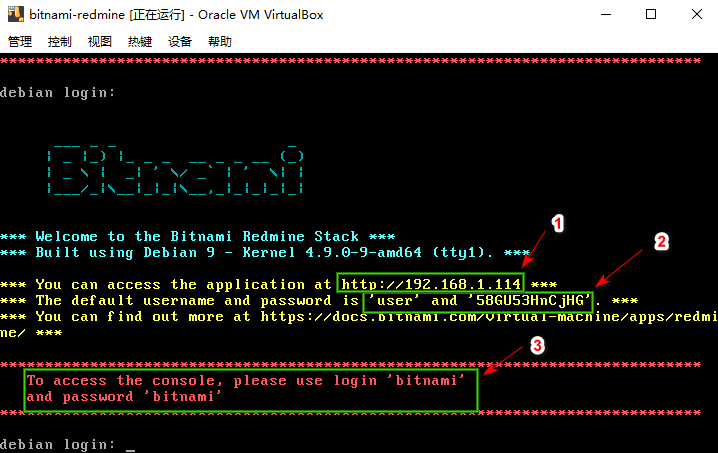
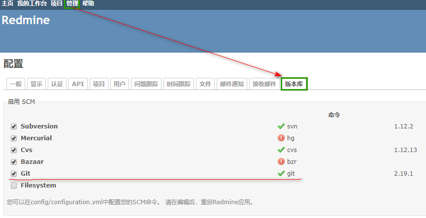
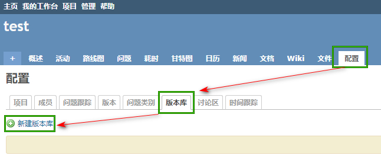
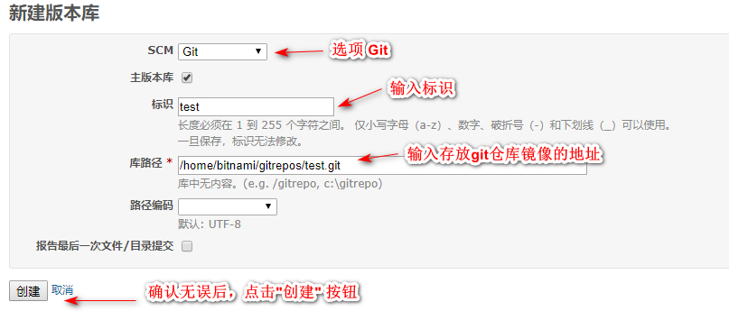
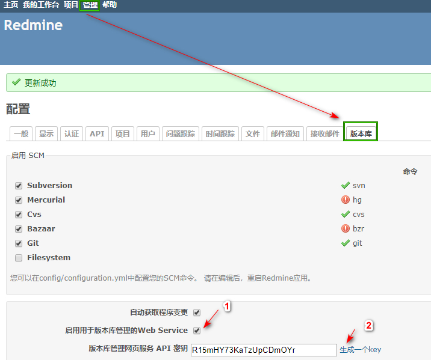
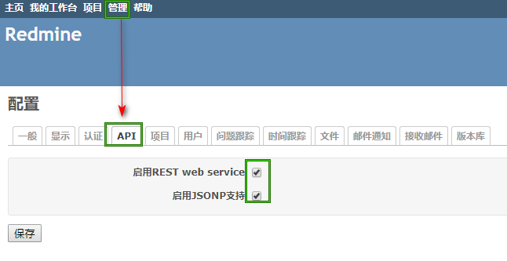
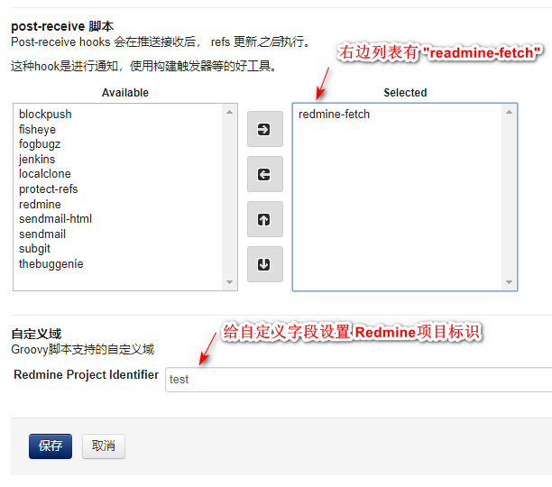

Redmine 和GitBlit仓库服务器整合


运行环境:

RedMine: 4.0.4

Git 仓库: Gitbilt V1.8.0

必须:

1. Redmine 安装并可运行
2. Redmine运行的主机里面已经安装了 `Git`,因需要在命令行中运行 git 命令


我运行的是bitnami的Redmine的Virtualbox 版本。地址是: [Bitnami Redmine](https://bitnami.com/stack/redmine/virtual-machine)

启动虚拟机之后，开机完成之后，会出现



1. 访问地址
2. redmine 默认的登录的用户名和密码，redmine默认的登录密码也是 mysql `root` 用户的密码 [Obtain MySQL Credentials](https://docs.bitnami.com/virtual-machine/apps/redmine/get-started/find-credentials-link-mysql/)
3. 访问控制台(ssh)的默认用户名和密码


**注**: 如果 运行`ifconfig` 命令，提示`ifconfig`命令找不到，可以尝试运行`sudo ifconfig`

开始以为是没有安装 `net-tools`，尝试命令`sudo apt install net-tools`去安装，提示已经安装了。

虚拟机默认是禁用ssh登录的，通过官方的教程[Enable Or Disable The SSH Server](https://docs.bitnami.com/virtual-machine/faq/get-started/enable-ssh/)

debian

```
sudo rm -f /etc/ssh/sshd_not_to_be_run
sudo systemctl enable ssh
sudo systemctl start ssh
```


###  将仓库拷贝到本地


```
bitnami@debian:~$ cd ~
bitnami@debian:~$ mkdir gitrepos
bitnami@debian:~$ sudo chown -R www-data:www-data gitrepos
bitnami@debian:~$ sudo chmod -R a+rwx gitrepos
bitnami@debian:~$ cd gitrepos
bitnami@debian:~/gitrepos$ sudo -u www-data -H git clone --mirror git://192.168.1.142/test.git test
```


**是将对应项目的git镜像到本地(不是源码下载到本地哦)**


### Readmine 配置

1. 查看 Git 是否可用



2. 给项目新建版本库





修正: 库路径结尾没有`.git` ，因为上面已经取了别名是`test`

查看是否能正常显示源码


从上图可以看到，成功显示源码和提交历史。如果开始是一个空仓库，可能会提示类似"该目录下没有条目或者文件"


3. 使用 Linux的定时任务定时拉取仓库

创建一个 shell 文件，如: `git_repo_test.sh`,内容

```
#!/bin/bash

cd /home/bitnami/gitrepos/test && sudo -u www-data -H git fetch
```

保存之后，尝试运行脚本，运行成功，


下一步将定时每5分钟运行这个脚本


```
crontab -e
```

在打开的crontab 编辑文件中添加

```
*/5 * * * * cd /home/bitnami/gitrepos/test && sudo -u www-data -H git fetch
```

编辑完之后，重启 cron 服务


```
sudo service cron restart
```

最后在 Redmine中，看到 仓库的更新记录，如果有新提到远程仓库，5分钟之后，会通过定时任务自动拉取提交的记录

------

### 其它 Redmine和GitBilt 集成

1. 在管理，版本库，开启 Web Service,并生成key 和 对Readmine的通知





| 跟踪标签 | 用于解决问题的关键字 | 应用后的状态 | % 完成 |
| -------- | -------------------- | ------------ | ------ |
| 全部     | fixes,fixed          | Resolved     | 80%    |
| 全部     | closes,closed        | Closed       | 100%   |
| 全部     | developing,doing     | In Progress  | 20%    |


2. 开启 Readmine的API

   
API选项卡 里面的两个都勾选

3. 修改Gitbilt 配置文件

修改 Gitbilt 文件夹下`data` 的 `gitblit.properties` 文件

在文件夹中，添加 

```
groovy.customFields = "redmineProject=Redmine Project Identifier"
```


最后我的`gitblit.properties`的内容是:

```
#
# GITBLIT.PROPERTIES
#
# Define your custom settings in this file and/or include settings defined in
# other properties files.
#

# Include Gitblit's 'defaults.properties' within your configuration.
#
# NOTE: Gitblit will not automatically reload "included" properties.  Gitblit
# only watches the 'gitblit.properties' file for modifications.
#
# Paths may be relative to the ${baseFolder} or they may be absolute.
#
# COMMA-DELIMITED
# SINCE 1.7.0
include = defaults.properties
groovy.customFields = "redmineProject=Redmine Project Identifier"
#
# Define your overrides or custom settings below
#
#git.repositoriesFolder=E:\devops\gitblit\repos
server.httpPort=10101
server.httpBindInterface=0.0.0.0

#tickets.service = com.gitblit.tickets.FileTicketService
#tickets.acceptNewTickets = true
```

4. 修改 GitBilt 的`redmine-fetch.groovy` 文件

修改 GitBilt 安装文件夹下，修改`data/groovy` 文件夹下的 `redmine-fetch.groovy`  文件,修改 `redmineURL`和`apiKey` 2个变量的值,修改的值如下:

```
/*
 * This script triggers automatic repo fetches in Redmine upon pushes.
 * It won't work out-of-box, you need to configure a few things.
 *
 * Redmine
 *  - Go to Administration / Settings / Repositories, and make sure that the
 *    "Enable WS for repository management" option is checked. Also generate an
 *    API key and take note of it.
 *  - Open a project page, go to Settings / Repositories and add a repo. Take
 *    note of the Identifier.
 *
 * Gitblit
 *  - Set the redmineProject custom field in gitblit.properties, e.g.
 *    groovy.customFields = "redmineProject=Redmine Project Identifier"
 *  - Edit the repo you added to Redmine, go to hook scripts and add this script
 *    to the post-receive hooks. Also specify the Redmine project's identifier
 *    under custom fields.
 *
 * Troubleshooting
 *  - run Gitblit interactively and check its console output
 *  - on the Redmine server, tail -f log/access.log
 *
 * If you want your repos to work with multiple Redmine projects, you don't need
 * to add the repos to all of them. Instead, add the repo to a single project,
 * then go to Administration / Settings / Repositories and enable the "Allow
 * issues of all the other projects to be referenced and fixed" option.
 */

/* specify the URL of your Redmine instance here */
def redmineURL = "http://192.168.1.114/"

/* specify the API key you generated in Redmine Administration here */
def apiKey = "R15mHY73KaTzUpCDmOYr"

/*
 * construct the URL from global and repo properties, for more info refer to
 * http://www.redmine.org/projects/redmine/wiki/RedmineSettings#Fetch-commits-automatically
 */
def triggerURL = redmineURL + "sys/fetch_changesets?id=" + repository.customFields.redmineProject + "&key=" + apiKey

/* log the action */
logger.info("Redmine Fetch hook triggered by ${user.username} for ${repository.name}: GET ${triggerURL}")

/* send the HTTP GET query */
new URL(triggerURL).getContent()
```

修改完之后，重启启动GitBilt

下一步，在 版本库列表，进入仓库 `test`详情页，点击右上角的 "编辑"按钮


进入编辑页面之后，选择`receive` 选项卡，进入`Receive 设置`页面



最后 给 `test`仓库推送提交，GitBilt的命令窗口显示，请求Redmine的Api地址成功


------
### bitnami  redmine 程序的命令备忘

```
sh /opt/redmine-3.4.4-1/ctlscript.sh restart

sh /opt/redmine-3.4.4-1/ctlscript.sh restart mysql

/opt/redmine-3.4.4-1/ruby/bin/bundle install --path vendor/bundle

sudo /opt/redmine-3.4.4-1/mysql/bin/mysqld_safe --pid-file=/opt/redmine-3.4.4-1/mysql/data/mysqld.pid --datadir=/opt/redmine-3.4.4-1/mysql/data --init-file=/home/test/mysql-init 2> /dev/null &


/opt/redmine-3.4.4-1/mysql/bin/mysqldump -A -u root -p > backup.sql
```

##### References

1. [Debian9 ifconfig命令找不到解决办法](https://www.cnblogs.com/pipci/p/9634060.html) 学习到 `ifconfig` 命令是属于`nettools`软件的
2. [redmine集成git](https://www.cnblogs.com/chencidi/p/9111054.html)
3. [redmine整合gitlab版本库](https://blog.csdn.net/danqingc/article/details/88035876) 学习到给仓库存放文件夹的拥有者为apache用户和分配权限，最后 定时任务 更新仓库成功啦
4. [Hook redmine git repository via gitblit](https://budiadiono.wordpress.com/2012/03/28/hook-redmine-git-repository-via-gitblit/) 我安装使用的Redmine已经有自带`redmine-fetch.groovy` 文件，所以不需要按文章中介绍的编辑 groovy文件
5. [RedmineとGitLabの連携。PushでチケットのStatusを変更](https://blog.dksg.jp/2015/05/redminegitlabpushstatus.html) gitlab 和 redmine 整合
9. [redmine edit issue description](http://www.redmine.org/projects/redmine/wiki/RedmineIssues#Editing-an-existing-issue)
7. [redmine roles wiki](http://www.redmine.org/projects/redmine/wiki/RedmineRoles)
8. [redmine gitlab 整合](https://docs.gitlab.com/ce/user/project/integrations/redmine.html)
9. [Visibility level visibilitylevel|public is not allowed in a visibilitylevel|private group.](https://gitlab.com/gitlab-org/gitlab-ce/issues/14806)  
10. [GitLabとRedmineを連携してみるの巻](http://toritori0318.hatenadiary.jp/entry/20140620/1403287430)
11. [Create And Restore Application Backups](https://docs.bitnami.com/virtual-machine/apps/redmine/administration/backup-restore/) redmine创建和还原应用程序备份
