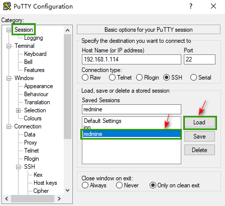
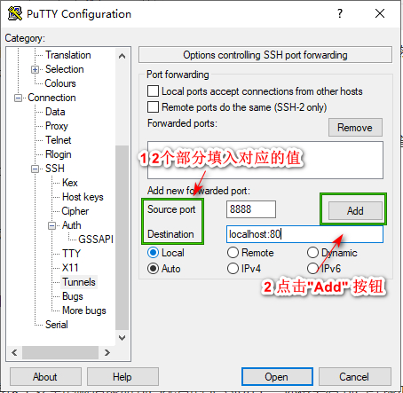
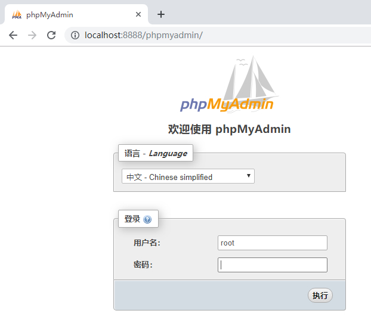
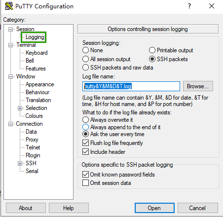
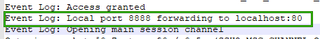

[翻译]windows下   连接到 bitnami的phpmyadmin

bitnami 因为安全考虑，只能 localhost 访问 phpmyadmin

为了能通过SSH 隧道访问 phpMyAdmin,你需要一个ssh 客户端。参考文章介绍使用中选择使用  [PuTTY](https://www.chiark.greenend.org.uk/~sgtatham/putty/latest.html), 一个Windows和Linux 平台下的免费的ssh 客户端。第1步配置 Putty.[Find out how to configure PuTTY](https://docs.bitnami.com/virtual-machine/faq/get-started/connect-ssh/#connect-with-an-ssh-client).

如果你已经在SSH 客户端配置过了，并且你已经确认是可以通过SSH成功访问你的SSH实例,为了能访问phpMyAdmin 你需要创建一个SSH隧道.跟着这些的步骤

**注:** 如上图，在"Session"中，可以看到一个名字叫 已经配置成功的"redmine" 会话，然后点击"Load",上面的 主机地址和端口会根据保存的SSH信息重新赋值

* 在 "Connection -> SSH -> Tunnels" 节点，通过以下介绍的值添加一个新的转发窗口
    * Source port: 8888
    * Destination: localhost:80

记住，如果你http重定向访问HTTPS端口，你必须使用 443 端口代替 80端口。

它将创建一个安全的隧道转发远程服务器的一个端口("源端口")到本地(127.0.0.1 或者 localhost)的一个端口("目标端口")。

* 点击"Add"按钮将这个安全的隧道添加到已配置的Session上。你将会看到已经添加好的端口出现在"Forwarded ports"列表中

* 在 “Session”节点，通过点击"Save"按钮保存 你的修改
* 点击"Open"按钮 开启一个连接服务器的 SSH 会话，这个SSH 会话现在将会包含带有两个个指定端口的一个安全的SSH隧道
* 通过你已创建的安全的SSH隧道来访问 phpMyAdmin控制台，在浏览器浏览 *http://127.0.0.1:8888/phpmyadmin* 
* 通过使用以下的认证信息来登录phpMyAdmin:
    * Username: root 
    * Password: application password. (参考我们的 [FAQ](https://docs.bitnami.com/virtual-machine/faq/get-started/find-credentials/)学习如何获取你应用程序的认证信息).

这应该是你会看到的一个举例:

如果你不能访问 phpMyAdmin,通过检查 PuTTY 的日志文件验证已经创建的SSH 隧道

Session 里面的Logging 的节点， Session logging为不是"None"

如果只是为了记录当前的会话日志，可以点击 "Open"

如果需要保存"Logging"的修改， 回到 "Session" 节点，点击"Save"按钮来保存修改

打开putty的日志，可以看到类似下面"Event Log:"开头的记录:

在 Linux,Mac OS X访问 phpMyAdmin 略(因没有指定的环境尝试),可以跳转到下面参考链接的 bitnami 源文档进行操作

#####  References

[Connect To PhpMyAdmin](https://docs.bitnami.com/virtual-machine/apps/roundcube/get-started/access-phpmyadmin/) 使用 Putty 转发 8888 到本地 80，进行访问 bitnami phpmyadmin.