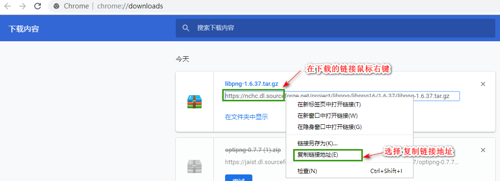

Centos 安装php Imagick 扩展

## 从 centos 仓库安装

首先安装 php-pear php-devel,gcc三个软件包

```
yum install php-pear php-devel gcc 
```

通过 yum 安装Centos 官方源的 imageMagick 软件

```
yum install ImageMagick ImageMagick-devel ImageMagick-perl
```

下一步，验证`ImageMagick`已经安装在你的系统上并验证它的版本

```
# convert --version

Version: ImageMagick 6.7.2-7 2017-03-22 Q16 http://www.imagemagick.org
Copyright: Copyright (C) 1999-2011 ImageMagick Studio LLC
Features: OpenMP   
```

## 通过ImageMagick源码安装

未尝试


## 安装 ImageMagick php扩展

下面通过简单的`pecl`命令来安装 PHP的 ImageMagick 扩展，它将会安装 ImageMagick 和 一个在`/usr/lib/php/modules`目录下的一个文件名是`imagick.so`的ImageMagick php扩展。如果你是使用64位系统，这个扩展放的路径是在`/usr/lib64/php/modules`

```
# pecl install imagick 
WARNING: channel "pecl.php.net" has updated its protocols, use "pecl channel-update pecl.php.net" to update
downloading imagick-3.4.4.tgz ...
Starting to download imagick-3.4.4.tgz (253,434 bytes)
.....................................................done: 253,434 bytes
19 source files, building
running: phpize
Configuring for:
PHP Api Version:         20170718
Zend Module Api No:      20170718
Zend Extension Api No:   320170718
Please provide the prefix of ImageMagick installation [autodetect] : 
```
**注意**:它将会询问你给ImageMagick设置安装的前缀，最简单是按回车键(Enter)让其自动选择

在安装成功之后，会输出类似下面的信息，告诉你`imagick.so`文件所在的路径

```
Build process completed successfully
Installing '/usr/lib64/php/modules/imagick.so'
Installing '/usr/include/php/ext/imagick/php_imagick_shared.h'
install ok: channel://pecl.php.net/imagick-3.4.4
configuration option "php_ini" is not set to php.ini location
You should add "extension=imagick.so" to php.ini
```


现在，添加`imagick.so` 扩展到 `/etc/php.ini` 文件中

```
echo extension=imagick.so >> /etc/php.ini
```

下一步重启 apache 服务器

```
service httpd restart
```

你可以运行下面的命令来验证 imagick php扩展.你将会看到一行小的 `imagick`文字 在下面输出

```
# php -m | grep imagick

imagick
```

当然，你可以创建一个 php 文件，使用`phpinfo()`函数输出 php信息。

-----

图片优化[image-optimizer](https://github.com/psliwa/image-optimizer)

安装里面的依赖工具

1. [svgo](https://github.com/svg/svgo)

```
npm install -g svgo
```

2. [jpegoptim](https://github.com/tjko/jpegoptim)

```
# yum install libjpeg 
# git clone https://github.com/tjko/jpegoptim.git
# cd jpegoptim/
# ./configure
# make
# make install

/usr/bin/install -c -d -m 755 /usr/local/share/man/man1
/usr/bin/install -c -d -m 755 /usr/local/bin
/usr/bin/install -c -m 644 jpegoptim.1 /usr/local/share/man/man1/jpegoptim.1
/usr/bin/install -c -m 755 jpegoptim /usr/local/bin/jpegoptim
```

3. [optipng](http://optipng.sourceforge.net/)

点击页面的下载源码包，然后跳到 sourceforge页面下载，等chrome出现下载，进入 chrome的下载管理，复制下载链接




```
cd /tmp
wget wget https://jaist.dl.sourceforge.net/project/optipng/OptiPNG/optipng-0.7.7/optipng-0.7.7.zip
unzip optipng-0.7.7.zip
cd optipng-0.7.7
./configure
make
make install
optipng #验证是否运行安装成功
```

4. [pngquant](https://pngquant.org/)

首先需要安装 libpng 软件，如果没有安装的话

进入[libpng](http://www.libpng.org/pub/png/libpng.html)，下载 .tar.gz 格式的文件

和上面一样，当文件在 chrome开始下载的时候，打开chrome的下载内容，复制下载地址

```
cd /tmp
wget https://nchc.dl.sourceforge.net/project/libpng/libpng16/1.6.37/libpng-1.6.37.tar.gz
tar -zxvf libpng-1.6.37.tar.gz
cd libpng-1.6.37
./configure
make
make install
ldconfig 
pngfix # 验证libpng是否安装成功
```


然后安装 pngquant

```
cd /tmp
git clone git://github.com/kornelski/pngquant.git
cd pngquant
./configure
make
make install
pngquant -h  #验证是否安装成功
```

因为gif扩展不需要使用，所以没有安装


#### 问题

如果运行,出现`error while loading shared libraries: libpng16.so.16`

```
pngquant -h

pngquant: error while loading shared libraries: libpng16.so.16: cannot open shared object file: No such file or directory
````


可以先找以下 libpng16所在的位置

```
whereis libpng16.so.16

libpng16.so: /usr/local/lib/libpng16.so /usr/local/lib/libpng16.so.16
```

发现编辑的文件不在 `/usr/lib`,`/usr/lib64` 2个文件夹下

```
ls /usr/local/lib #列出该文件夹的文件

libpng16.a   libpng16.so     libpng16.so.16.37.0  libpng.la  pkgconfig
libpng16.la  libpng16.so.16  libpng.a             libpng.so
```

使用`ln`软链接的方式，将文件放入到放到 `/usr/lib`,`/usr/lib64`下


```
ln -s /usr/local/lib/libpng16.so /usr/lib/
ln -s /usr/local/lib/libpng16.so.16 /usr/lib64/
```

然后在运行`pngquant -h` 就显示该命令的帮助信息了

[error while loading shared libraries libpng16](https://stackoverflow.com/a/46613940) 这里提到的在 `make install`之后，再运行`ldconfig`命令，感觉没有效果

##### References
1. [Install ImageMagick (Image Manipulation) Tool on RHEL/CentOS and Fedora](https://www.tecmint.com/install-imagemagick-in-linux/)
2. [CentOS 6 系における tmux のインストール](https://qiita.com/szit/items/9c7e3831c03c42c360f3)