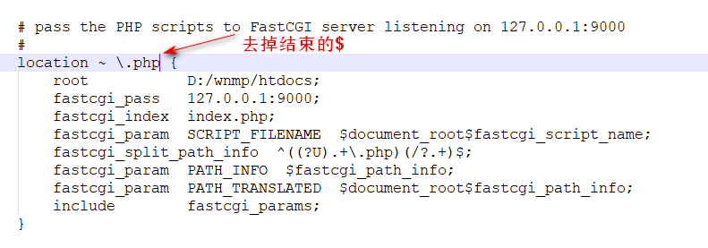

nginx配置path_info，让codeigniter访问其它路由不是404

这是我的nginx 关于 php 部分的的配置内容
```
# 去掉 \.php$ 后面的$符号
location ~ \.php {
            root           D:/wnmp/htdocs;
            fastcgi_pass   127.0.0.1:9000;
            fastcgi_index  index.php;
            fastcgi_param  SCRIPT_FILENAME  $document_root$fastcgi_script_name;
			fastcgi_split_path_info  ^((?U).+\.php)(/?.+)$;
			fastcgi_param  PATH_INFO  $fastcgi_path_info;
			fastcgi_param  PATH_TRANSLATED  $document_root$fastcgi_path_info;
            include        fastcgi_params;
        }
```


> 要点1:去掉location后的正则php后面的"$"符号 使其url不会被截断

------

##### nginx 挂载其它目录的配置备忘部分

```
server {
		listen       8092;
        server_name  192.168.1.108:8092;
		autoindex on;
		root   L:/;
		charset utf-8,gbk;
		
		location /software {
			root   L:/;
			#Nginx日志目录
     		 autoindex on;
         #打开目录浏览功能
         autoindex_exact_size off;
         #默认为on，显示出文件的确切大小，单位是bytes
         #显示出文件的大概大小，单位是kB或者MB或者GB
         autoindex_localtime on;
         #默认为off，显示的文件时间为GMT时间。
         #改为on后，显示的文件时间为文件的服务器时间
         add_header Cache-Control no-store;
         #让浏览器不保存临时文件
       }
	}
```


## References

* [CodeIgniter Nginx配置 使他支持pathinfo路由模式](https://www.cnblogs.com/lost-1987/articles/2720562.html)
* [Nginx下配置codeigniter框架](https://www.cnblogs.com/wangxuchun/p/4386093.html)