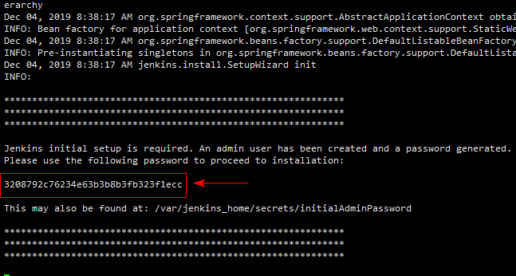
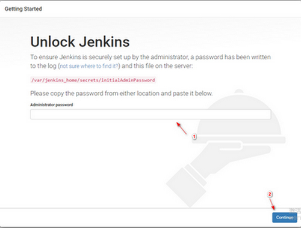
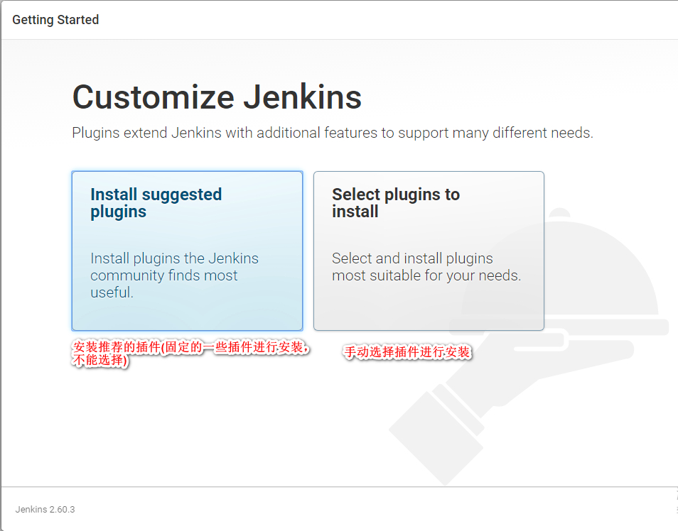
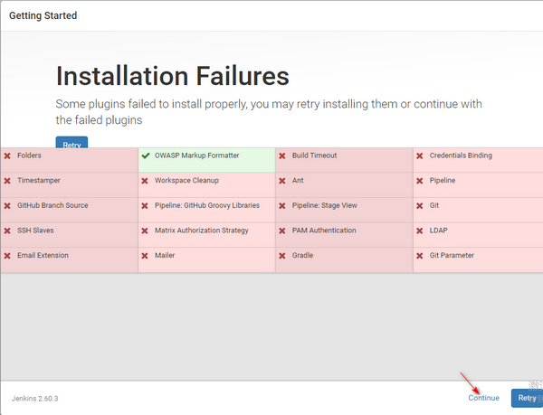
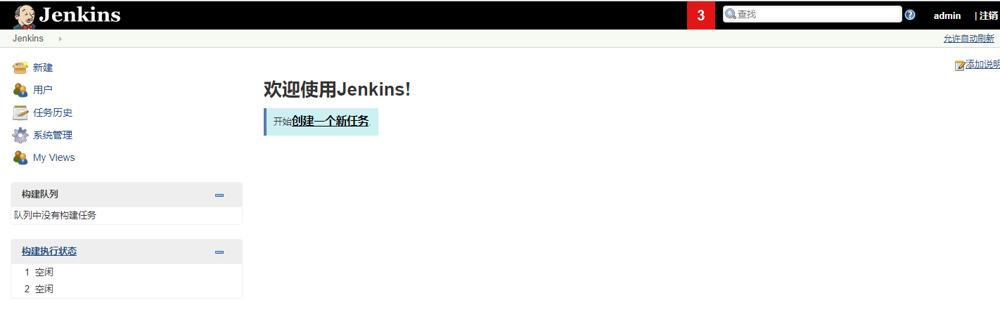

docker 安装 jenkins 笔记

前提: 已安装好 docker，可运行 docker 命令

命令:

```
sudo docker pull jenkins

mkdir -p ~/dockers/jenkins
cd ~/dockers
sudo docker run --name jenkins01 -p 8081:8080 -p 50000:50000 -v ${PWD}/jenkins:/var/jenkins_home jenkins:latest
```

 报错 :

```
touch: Can not write to /var/jenkins_home/copy_reference_file.log. Wrong volume permissions?
cannot touch '/var/jenkins_home/copy_reference_file.log': Permission denied
```

>  需要修改下目录权限, 因为当映射本地数据卷时，/home/docker/jenkins目录的拥有者为root用户，而容器中jenkins user的uid为1000 

```
sudo chown -R 1000:1000 ~/dockers/jenkins

sudo docker rm jenkins01 

sudo docker run --name jenkins01 -p 8081:8080 -p 50000:50000 -v ${PWD}/jenkins:/var/jenkins_home jenkins:latest
```

运行一段时间，可以看到输出初始化的密码




通过浏览器访问 `http://ip:8081` 进入初始页,输入初始的管理员密码






可选择 "安装推荐的插件"或者 "选择插件来安装"




等待插件的安装完成，然后点 `Continue` 进入下一步，进入`Create First Admin User` 页面，创建第一个 admin  用户，然后依次点击保存并完成，进入到jenkins的首页。



至此，docker 版本的jenkins的安装已经结束。


## References

* [docker运行jenkins](https://segmentfault.com/a/1190000008618462) 学习到解决启动时的报错部分
* [Docker 之 Jenkins自动化部署](https://www.jianshu.com/p/a1aef2f7da56) 主要参考
* [docker安装jenkins最新版本](https://www.jianshu.com/p/12c9a9654f83) 有中文版本的安装界面截图