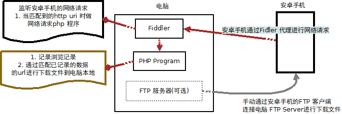

使用 fiddler 和PHP程序将快手无水印视频保存在电脑上

## 前言

因之前看了一些博文，了解 快手apk里面有一个`sig`参数，通过`jadx` 查看 apk 研究一段时间之后，一直没有结果，并放弃研究 apk代码了。

之前通过 fiddler 监听 快手app的请求，发现一些请求是有返回 视频的无水印的URL的，并且fiddler script 支持编写对一些匹配的uri地址进行一些获取响应结果和请求参数的api，所以弄了个曲线的方式获取 无水印视频。

需要的设备:

1. 已安装 Fiddler 软件和有WAMP(WIndows下安装Apache,PHP,Mysql软件,我为了省事，使用的是 phpstudy)的电脑
2. 安卓手机连接的WLAN 的代理已配置好 Fiddler的连接信息

构思:

## 步骤

1. 