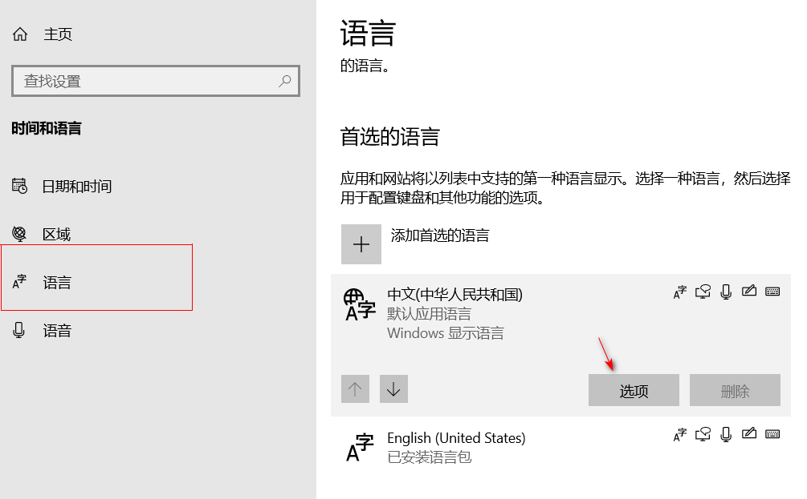

win10 移除2345输入法

1. 进入win10 `设置`,语言，然后点击`简体中文`，然后点击`选项`

然后在 键盘 下移除 2345 输入法(如果移除按钮是灰色的，可以新增一个中文输入法：如小狼毫，搜狗输入法 后，再试移除2345输入法)

## References

[关于完全卸载2345王牌输入法-win10](https://www.cnblogs.com/o-din/p/9465100.html) 