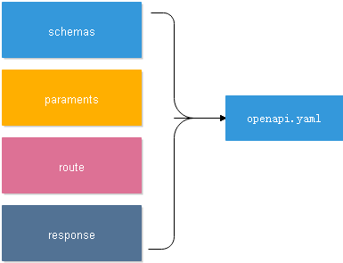

一个大的OpenAPI Specification yaml 分割成小的yaml文件

## 前言



遵循的yaml格式是 swagger 官网的 [OAS3](https://swagger.io/specification/) 的说明,主要参考文章 [How to split a large OpenAPI Specification into multiple files](https://davidgarcia.dev/posts/how-to-split-open-api-spec-into-multiple-files/)

依赖运行环境:  Nodejs, jdk1.8+
在这个文章，将以经典的 [PetStore]() 为列来讲如何将大文件分离到更小的文件中，所以也适用于你自己的定义。

## 正文

1. 重复引用定义来自文件

```
paths:
  /pets/{petId}:
    get:
      summary: Info for a specific pet
      operationId: showPetById
      parameters:
        - name: petId
          in: path
          required: true
          description: The id of the pet to retrieve
          schema:
            type: string
      responses:
        '200':
          description: Expected response to a valid request
          content:
            application/json:
              schema:
                  type: object
                  required:
                    - id
                    - name
                  properties:
                    id:
                      type: integer
                      format: int64
                    name:
                      type: string
                    tag:
                      type: string
```


## 依赖

1. 通过npm安装[swagger-cli](https://www.npmjs.com/package/swagger-cli), 用于将多个 yaml 文件合并为一个 yaml 文件

```
npm install -g swagger-cli
```

2. 从[swagger-api/swagger-codegen](https://github.com/swagger-api/swagger-codegen#prerequisites) 的说明，下载 `swagger-codegen-cli-3.0.20.jar`,我目前看到的链接是:

```
https://repo1.maven.org/maven2/io/swagger/codegen/v3/swagger-codegen-cli/3.0.20/swagger-codegen-cli-3.0.20.jar
```

## 后记

因为自己个人习惯将请求路径按功能模块放入到不同的yaml文件中，以方便自己维护api文档，但这样也添加了时间成本，因为需要先执行合并yaml文件的命令，然后再将执行将 yaml文件转换为swagger-ui能识别的json文件的命令


## References

*  [How to split a large OpenAPI Specification into multiple files](https://davidgarcia.dev/posts/how-to-split-open-api-spec-into-multiple-files/) 主要学习了如何将一个大的yaml文件分离小的yaml文件
* [download swagger codegen -cli](https://github.com/swagger-api/swagger-codegen#prerequisites)
* [How do I combine multiple OpenAPI 3 specification files together?](https://stackoverflow.com/questions/54586137/how-do-i-combine-multiple-openapi-3-specification-files-together/54593633#54593633)
* [dgarcia360/openapi-boilerplate](https://github.com/dgarcia360/openapi-boilerplate)