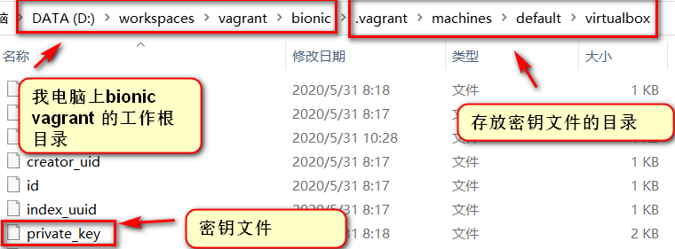
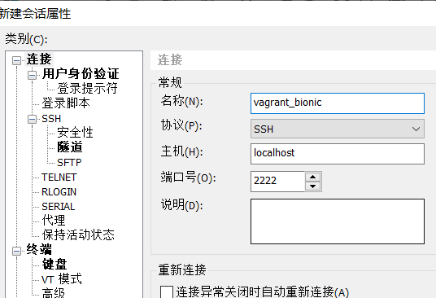
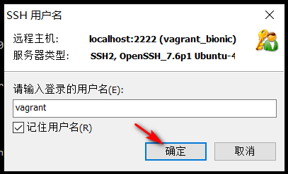
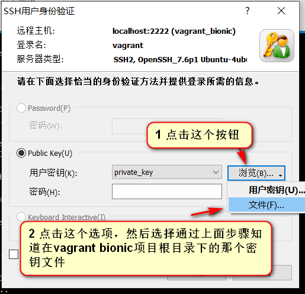

windows vagrant ubuntu bionic(18.04) cloud images 笔记


## 前言

这是我使用 vagrant + virtualbox 6.0 基于ubuntu bionic(18.04) cloud image box 搭建 LAMP(Apache + Mysql 5.7 + PHP7.2)的命令流水帐。

因为我个人对Nginx的配置不熟悉，导致我尝试基于Thinkphp6和TP多应用插件的项目，访问多应用的路由总是显示404,后换回熟悉的Apache环境，同样的项目，多应用的路由访问正常了(我猜想是我没有配置好我运行环境中Nginx关于pathinfo部分的配置项)


## 正文


从 [ubuntu/trusty64](https://app.vagrantup.com/ubuntu/boxes/trusty64) 版本中，有显示`virtualbox Externally hosted (cloud-images.ubuntu.com)`的字样，
通过访问[http://cloud-images.ubuntu.com/](http://cloud-images.ubuntu.com/), 然后到[http://cloud-images.ubuntu.com/bionic/current/](http://cloud-images.ubuntu.com/bionic/current/)
发现有 `bionic-server-cloudimg-amd64-vagrant.box`,这是 vagrant的box

然后通过[清华大学开源软件镜像站](https://mirror.tuna.tsinghua.edu.cn/) 列表中的 [ubuntu-cloud-images](https://mirror.tuna.tsinghua.edu.cn/ubuntu-cloud-images/)，我通过[https://mirror.tuna.tsinghua.edu.cn/ubuntu-cloud-images/bionic/current/](https://mirror.tuna.tsinghua.edu.cn/ubuntu-cloud-images/bionic/current/)
快速下载到了`bionic-server-cloudimg-amd64-vagrant.box`。


我以后下载 vagrant ubuntu的vagrant box，以后就可以通过国内的ubuntu镜像站的`ubuntu-cloud-images`节点，下载到对应版本的ubuntu vagrant box啦，解决了我下载ubuntu系统vagrant box慢的问题。


导入下载的ubuntu bionic vagrant box

通过命令窗口，到达存放bionic box的路径下

```
vagrant box add bionic bionic-server-cloudimg-amd64-vagrant.box
```


在命令行，去到vagrant的工作目录

```
# 使用新增名为 bionic的box
vagrant init bionic
```

启动

```
vagrant up
```


通过Xshell 连接ssh时，需要使用密钥进行登录(密钥文件在 当前vagrant 目录的`.vagrant/machines/default/virtualbox`)





使用 xshell 登录




确定保存之后，打开，输入用户名为`vagrant`






通过以上的步骤，应该能通过xshell 成功连接 vagrant 基于ubuntu bionic的虚拟机的ssh了。

------

备份source

`sudo cp /etc/apt/sources.list /etc/apt/sources.list.bak`

修改`sources.list`


```
# 默认注释了源码镜像以提高 apt update 速度，如有需要可自行取消注释
deb https://mirrors.tuna.tsinghua.edu.cn/ubuntu/ bionic main restricted universe multiverse
# deb-src https://mirrors.tuna.tsinghua.edu.cn/ubuntu/ bionic main restricted universe multiverse
deb https://mirrors.tuna.tsinghua.edu.cn/ubuntu/ bionic-updates main restricted universe multiverse
# deb-src https://mirrors.tuna.tsinghua.edu.cn/ubuntu/ bionic-updates main restricted universe multiverse
deb https://mirrors.tuna.tsinghua.edu.cn/ubuntu/ bionic-backports main restricted universe multiverse
# deb-src https://mirrors.tuna.tsinghua.edu.cn/ubuntu/ bionic-backports main restricted universe multiverse
deb https://mirrors.tuna.tsinghua.edu.cn/ubuntu/ bionic-security main restricted universe multiverse
# deb-src https://mirrors.tuna.tsinghua.edu.cn/ubuntu/ bionic-security main restricted universe multiverse

# 预发布软件源，不建议启用
# deb https://mirrors.tuna.tsinghua.edu.cn/ubuntu/ bionic-proposed main restricted universe multiverse
# deb-src https://mirrors.tuna.tsinghua.edu.cn/ubuntu/ bionic-proposed main restricted universe multiverse
```


```
sudo apt-get update

sudo apt-get install zip unzip

sudo apt-get install apache2

sudo apt-get install mysql-server mysql-client mysql-utilities


sudo apt-get install php

sudo apt-get install php-gd
sudo apt-get install php-xml php-xmlreader php-xmlrpc php-xmlwriter 
sudo apt-get install php-bcmath php-curl php-mbstring php-mysqli
sudo apt-get install php-pdo-sqlite
sudo apt-get install php-pgsql php-soap
sudo apt-get install php-dev

sudo apt-get install php-crypto

sudo a2enmod rewrite
sudo systemctl restart apache2

sudo vim /etc/apache2/sites-enabled/000-default.conf
```

在apache的配置文件中添加

```
<Directory "/var/www/html">
    AllowOverride All
</Directory>
```

重启 apache

```
sudo systemctl restart apache2
```

给`/var/www/html` 添加 777 权限

```
sudo chmod 777 /var/www/html
sudo chmod 777 /var/www/html/* -R
```


安装composer

```
php -r "copy('https://install.phpcomposer.com/installer', 'composer-setup.php');"
php composer-setup.php
php -r "unlink('composer-setup.php');"
```

全局安装

```
sudo mv composer.phar /usr/local/bin/composer
```

设置 composer 中国源

```
# https://pkg.phpcomposer.com/
composer config -g repo.packagist composer https://packagist.phpcomposer.com
# 或者https://developer.aliyun.com/composer
composer config -g repo.packagist composer https://mirrors.aliyun.com/composer/
```

取消composer配置

```
composer config -g --unset repos.packagist
```


Vagrant 配置

```
# -*- mode: ruby -*-
# vi: set ft=ruby :

# All Vagrant configuration is done below. The "2" in Vagrant.configure
# configures the configuration version (we support older styles for
# backwards compatibility). Please don't change it unless you know what
# you're doing.
Vagrant.configure("2") do |config|
  # The most common configuration options are documented and commented below.
  # For a complete reference, please see the online documentation at
  # https://docs.vagrantup.com.

  # Every Vagrant development environment requires a box. You can search for
  # boxes at https://vagrantcloud.com/search.
  config.vm.box = "bionic"

  # Disable automatic box update checking. If you disable this, then
  # boxes will only be checked for updates when the user runs
  # `vagrant box outdated`. This is not recommended.
  # config.vm.box_check_update = false

  # Create a forwarded port mapping which allows access to a specific port
  # within the machine from a port on the host machine. In the example below,
  # accessing "localhost:8080" will access port 80 on the guest machine.
  # NOTE: This will enable public access to the opened port
  # config.vm.network "forwarded_port", guest: 80, host: 8080

  # Create a forwarded port mapping which allows access to a specific port
  # within the machine from a port on the host machine and only allow access
  # via 127.0.0.1 to disable public access
  # config.vm.network "forwarded_port", guest: 80, host: 8080, host_ip: "127.0.0.1"

  # Create a private network, which allows host-only access to the machine
  # using a specific IP.
  # config.vm.network "private_network", ip: "192.168.33.10"
  config.vm.network "private_network", ip: "192.168.33.11"
  # Create a public network, which generally matched to bridged network.
  # Bridged networks make the machine appear as another physical device on
  # your network.
  # config.vm.network "public_network"

  # Share an additional folder to the guest VM. The first argument is
  # the path on the host to the actual folder. The second argument is
  # the path on the guest to mount the folder. And the optional third
  # argument is a set of non-required options.
  # config.vm.synced_folder "../data", "/vagrant_data"
  config.vm.synced_folder "D:/workspaces/lamp", "/var/www/html"
  # Provider-specific configuration so you can fine-tune various
  # backing providers for Vagrant. These expose provider-specific options.
  # Example for VirtualBox:
  #
  config.vm.provider "virtualbox" do |vb|
  #   # Display the VirtualBox GUI when booting the machine
  #   vb.gui = true
  #
  #   # Customize the amount of memory on the VM:
     vb.memory = "2049"
  end
  #
  # View the documentation for the provider you are using for more
  # information on available options.

  # Enable provisioning with a shell script. Additional provisioners such as
  # Puppet, Chef, Ansible, Salt, and Docker are also available. Please see the
  # documentation for more information about their specific syntax and use.
  # config.vm.provision "shell", inline: <<-SHELL
  #   apt-get update
  #   apt-get install -y apache2
  # SHELL
end
```