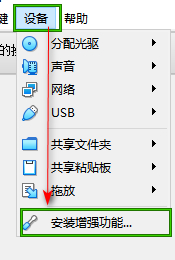
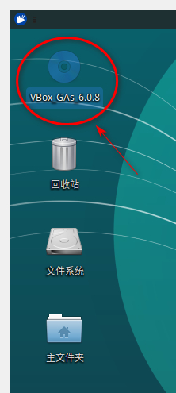
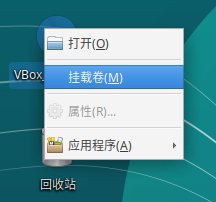
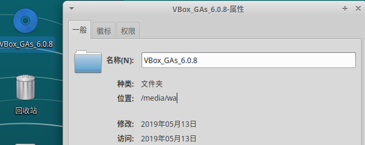
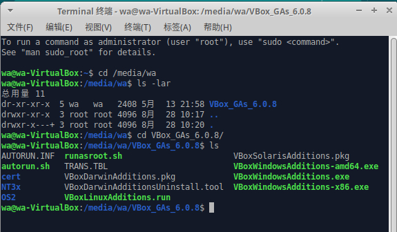

在Virtualbox安装的Ubuntu,默认不是全屏，操作起来不是很方便，网上查了资料，按照网上的教程来操作并记录下自己的操作记录。

在安装的Ubuntu的虚拟机，通过 "设备" -> "安装增强功能..."

等待一会虚拟机里面就会出现一个 "VBox" 开头的文件

看图标是灰色的，需要挂载到系统中

选择"挂载卷"

挂载完之后，查看该文件的属性

从上图清楚文件夹的完整路径是 `/media/wa/VBox_GAs_6.0.8`

下一步 应用程序->附件->终端。（也可用快捷键 Ctrl+Alt+T）

执行`cd /media/wa` （注意cd后面有空格）进入cd驱动器，

执行ls 看看里面有什么文件，发现有`VBox_GAs_6.0.8` 这个文件夹，

看到了 `VBoxLinuxAddittions.run`  文件

下一步执行 `sudo sh VBoxLinuxAddittions.run`

执行完毕之后，系统自动全屏了

假如没有自动全屏，需要 重启虚拟机，然后再设定分辨率应该就可以了

图床 [sm.sm](https://sm.sm)

##### References

1. [VirtualBox虚拟机 Ubuntu分辨率太小的解决方案](https://blog.csdn.net/yasi_xi/article/details/42388119)