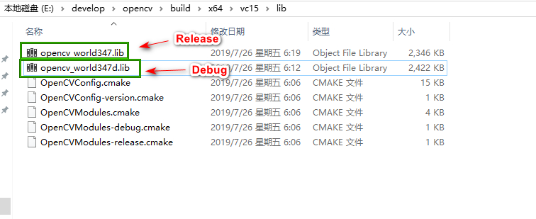

windows vs2019 + opencv 3.4.7环境搭建


## 安装Opencv 3.4.7

### 下载 Opencv

第1步 进入 opencv [releases](https://opencv.org/releases/) 页面，点击 "Windows"的下载链接之后，会跳到 `sourceforge.net` 网站，等待6秒钟之后，浏览器就会自动开始下载,下载过程会稍微比较久，需要耐心等待。


当下载完成之后，下一步，双击运行已下载好的 `opencv-3.4.7-vc14_vc15.exe`  文件,会询问解压存放的路径。解压即是安装

**【建议】在英文路径下，不用有中文和空格**


选择解压存放的文件夹就可以，因为OpenCV项目文件打包的时候，根目录就是`opencv`，所以我们不需要额外的新建一个名为opencv的文件夹。


在解压之后的文件夹中，`bulid`里面是使用OpenCV的相关文件，`sources`里面是源代码。

### 设置环境变量


把之前解压（安装）好的OpenCV路径下的bin路径添加到Path系统环境变量中。

如我存放的路径是"E:\develop\opencv\build\x64\vc15\bin"


在 编辑 环境变量窗口中 填入路径，然后 "确认" 就会关闭 "编辑环境变量"的窗口


然后依次将已打开的 "环境变量"和"系统属性" 窗口，都点击 "确定"，来关闭打开的窗口


## 安装Visual Studio

### 下载和安装 Visual Studio

Visual Studio 网站 [https://visualstudio.microsoft.com/zh-hans](https://visualstudio.microsoft.com/zh-hans)


选择社区版就行，安装过程很简单，一直下一步就行。


当运行已下载的 `vs_community.exe` 文件时，跳出安装的选择项，上图是我选择的，仅供参考，然后 点击"安装"就可以了。

### 创建一个项目

1. 新建项目
因为我是新安装的 vs 2019,所以入口是这样的，可以通过快捷键 `Ctrl+Shift+N` 来快速创建新项目


2. 新建一个cpp文件

通过vs 窗口头部菜单来新建一个cpp文件(看上面的提示，`Ctrl + N` 快捷键可以弹出新建文件窗口)

新建cpp文件


保存新建的cpp文件


将已保存的cpp 添加的 "源文件"中


3. 打开项目的 属性管理器

本人是在Debug x64下配置

通过菜单 "视图" -> "其它窗口" -> "属性管理器"


下一步，在打开的属性管理器的"Debug | x64" 右键，弹出的菜单选择"属性(R)"


下一步添加包含目录，`VC++ 目录` -> `包含目录`-> 选择编辑


添加。 点下面图中箭头指的图标，把以下路径添加 
（P.S.即之前解压（安装）好的OpenCV路径下的`build`文件夹）


下一步新增 `VC++ 目录` -> `库目录` -> 选择编辑

(ps. 即之前解压（安装）好的OpenCV路径下的 运行位数下的`lib`)


下一步 添加依赖项

`链接器` -> `输入` -> `附加依赖项 `

在上一步设定的lib文件夹中找到.lib文件：




可以看到 对应的2个 lib文件，知道2个lib的名字之后


不要直接复制名称进去，要**手动**敲入 `opencv_world347d.lib` 到`附加依赖项`的输入框中


注意:

1. 347对应OpenCV3.4.7。如果安装的OpenCV版本不是3.4.7,请去网上找到对应自己的版本或者看安装的文件`opencv-3.4.7-vc14_vc15.exe`( opencv-后面的就是版本)进行修改。 
2. 版本后面的`d`代表`Debug`模式，如果是`Release`模式要去掉d。依个人情况选择Debug模式或者Release模式。 

到此，opencv3.4.7与vs2019开发环境已配置成功。

`main.cpp`的代码

```
#include <opencv2/opencv.hpp>
#include <iostream>

using namespace std;
using namespace cv;

int main()
{
	Mat src = imread("C:/Users/Administrator/Downloads/heiheihei.png");
	imshow("显示一张图片", src);
	waitKey(0);
	return 0;
}
```

运行效果:


##### References 


1. [拜小白教你OpenCV3.2.0+VS2017开发环境配置](https://blog.csdn.net/sinat_36264666/article/details/73135823) 主要的参考文章
2. [OpenCV3.2.0+VS2017环境搭建](https://blog.csdn.net/adcxz/article/details/72991148)
3. [Win10下OpenCV环境搭建(VS2017+OpenCV3.2.0)](https://blog.csdn.net/weixin_37800680/article/details/70991173)