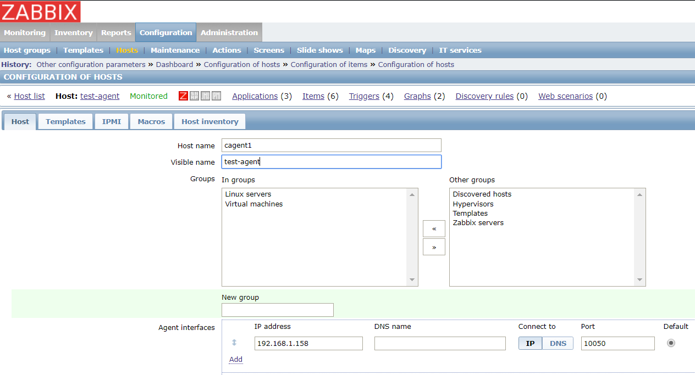
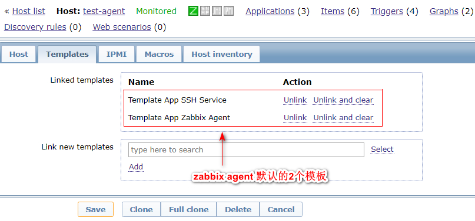
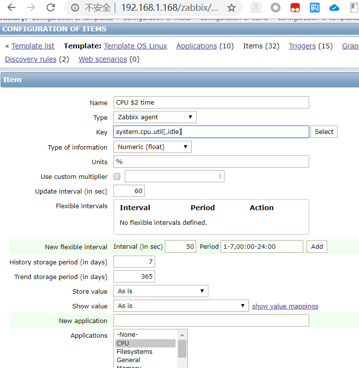
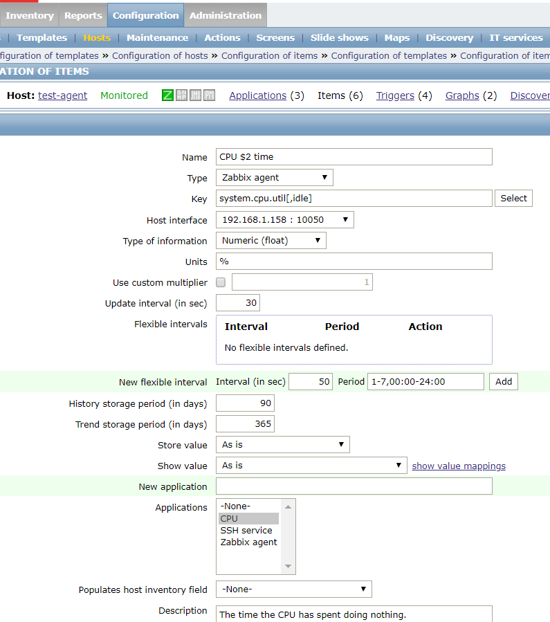
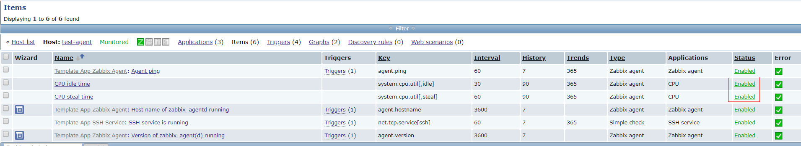
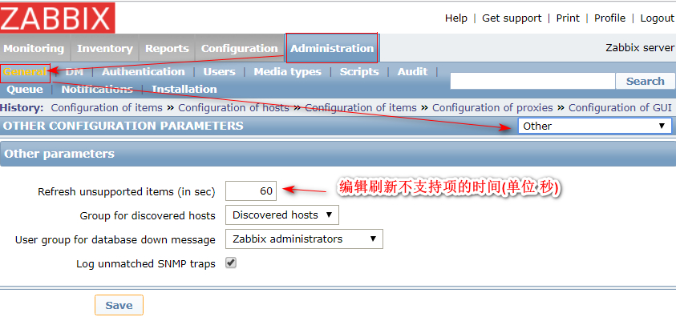
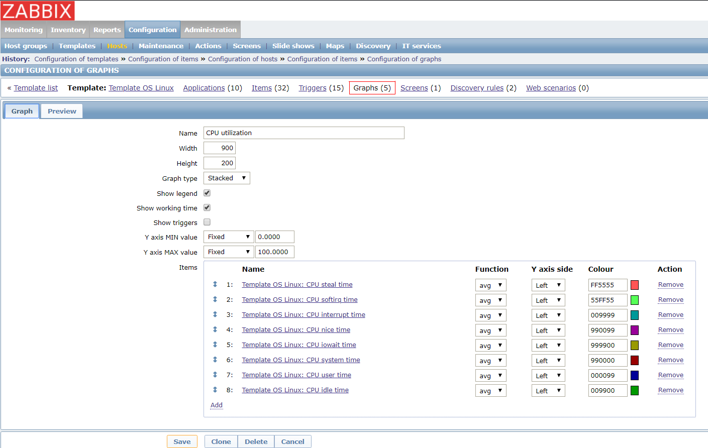

zabbix server 给agent 添加 CPU 监听

在 `Configuration` -> `Host` , 会显示一个 `Host` 列表，如果列表中没有监听的服务器，可以通过点击`Create Host` 新增一个`Host`

说明: 新增/编辑`Hosts`的标签页`Host`中的`Agent interfaces`的`IP adress` 填写被监听的服务器ip,默认监听的端口是`10050`

如:






为了能够监听 zabbix agent的CPU使用情况，点击上面图片的`Items`菜单项，进入`Items`列表，

我照着`Configuration` -> `Templates` -> `Template OS Linux`里面与CPU有关的`Items`资料输入的。

如: `CPU idle time`

已有的项是:



我在被监听的Host的Item 依葫芦画瓢式的新增`Item`，如下图:



**备注1**: `key` 项，需要先点击`Select` 按钮，在弹出的窗口选择一项, 如果选的项有参数，可以在`key`的文本框中编辑参数列表，如: 上图的`cpu idle time`，步骤是:

1. 点击 `select`按钮，在弹出的窗口选择`system.cpu.util[<cpu>,<type>,<mode>]`项

2. 在`key`的文本框就会填入`system.cpu.util[<cpu>,<type>,<mode>]`,然后在`key`的文本框中，将文本改为`system.cpu.util[,idle]`

3. 点击保存之后，再回到被添加Item的Host中看 `Items`列表，可以看到添加的项的状态是 `Enable`

   

**备注2**: 上面添加的的`key`是可以通过zabbix server上的`zabbix_get`命令来试的，如

```
waka@ubuntus1:/usr/local/zabbix/bin$ ./zabbix_get -s 192.168.1.158 -p 10050 -k "system.cpu.util[,idle]"
99.616539
```

**备注3**: 如果在 `Items` 列表中的一项的状态，显示`Not supported by Zabbix Agent`,可以先用备注2的命令来试里面的`key`是否可以获取到资料,

如:

```
waka@ubuntus1:/usr/local/zabbix/bin$  ./zabbix_get -s 192.168.1.158 -p 10050 -k "system.cpu.util[<cpu>,<type>,<mode>]"
ZBX_NOTSUPPORTED
```

1.  **确认Item的key是正确的，用zabbix_get 命令试是否可以获取资料**开始新建`Item`时，里面的`key`我是这样直接的，没有编辑，通过上面的命令，发现无法获取到资料

2. **使用zabbix_get 命令试，是可以获取到资料，但是页面还是显示**`Not supported by Zabbix Agent`
>    2.1. 等10分钟之后，zabbix会去重新check一次当前item的Supported状态
>    2.2. 删掉当前item，重新创建一个
>    2.3. 修改zabbix重新check的时间，例如改成1分钟，点击 `administration` -> `General` -> 右侧下拉条选择 `other`, 编辑 `Refresh unsupported items (in sec)`的值，如`60`（单位为秒)
>       

**备注4**: 如果出现以下的错误信息，需要在`agent`的服务器中启动`agent`，如:`sudo service  zabbix-agent start`

```
waka@ubuntus1:/usr/local/zabbix/bin$ ./zabbix_get -s 192.168.1.158 -p 10050 -k "system.uptime"
zabbix_get [1893]: Get value error: cannot connect to [[192.168.1.158]:10050]: [111] Connection refused
```


关于监听CPU的项(简要摘抄自参考文章2):

1. user : CPU一共花了多少比例的时间运行在用户态空间
2. System: CPU花了多少比例的时间在内核空间运行
3. Wait: CPU处于这种等待状态的时间 (`cpu is idle while waiting for an I/O operation to complete。The time the CPU spends in this state is shown by the wait statistic.`)
4. idle: CPU处于空闲状态时间比例。一般而言，idel + user + nice 约等于100%
5. nice: 可理解为，**用户空间进程**的CPU的调度优先级，范围为[-20,19]

在 zabbix server中新增的item的`key`有:

1. steal: `system.cpu.util[,steal]`
2. softirq:`system.cpu.util[,softirq]`
3. interrupt:`system.cpu.util[,interrupt]`
4. idle:`system.cpu.util[,idle]`
5. user: `system.cpu.util[,user]`
6. nice: `system.cpu.util[,nice]`
7. system: `system.cpu.util[,system]`
8. iowait:`system.cpu.util[,iowait]`

参考模板新建一个一样的`CPU utilization`的图表来显示 客户机(被监听服务器)的CPU使用率




## References

1. [zabbix：关于错误unsupported item key常见错误汇总](https://blog.csdn.net/qq_34355232/article/details/82658687)
2. [关于CPU的User、Nice、System、Wait、Idle各个参数的解释](https://www.cnblogs.com/hapjin/p/6296296.html)