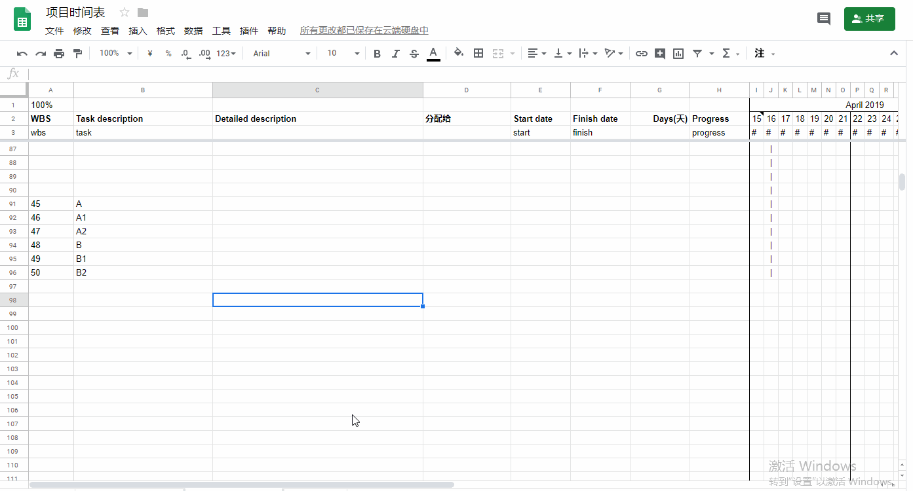

# Google Projectsheet Planning 插件的WBS

生成 WBS的序列號

在 Sldebar中的 "WBS" 按鈕:

1. "< WBS" 取消下級目錄

2. "WBS >" 生成下級目錄

Gif录制工具: LICEcap

##### Reference

1. [【無料】Googleスプレッドシートを最強プロジェクト管理ツールにする方法【裏技】](https://boxil.jp/mag/a65/)
2. [Googleスプレッドシートでガントチャートを自動生成するアドオンを作ってみた](https://takuya0206.hateblo.jp/entry/ganttchart_generator) 另外一個Google Sheets 插件 Gantt Chart Generator
