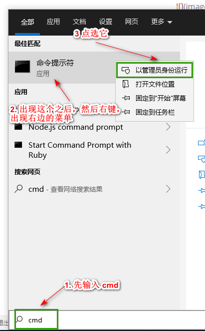
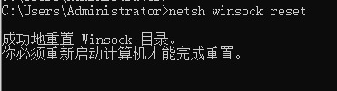

#  Chrome DNS_PROBE_FINISHED_NXDOMAIN

win10 下的Chrome访问网站时，提示`DNS_PROBE_FINISHED_NXDOMAIN`


解决方法很简单：

用管理员身份打开cmd后，运行如下指令即可解决问题。



运行命令:

```
netsh winsock reset
```

具体操作，如下图：



注明: 在 cmd中，点击右键，可以起到粘贴的左右(如果有复制文本的情况下)

##### References
1. [DNS_PROBE_FINISHED_NXDOMAIN错误的解决方法](https://blog.csdn.net/leekwen/article/details/73530337)

# phpStorm 激活


[IntelliJ IDEA 注册码](http://idea.lanyus.com/)

1. 修改自己电脑的host 文件,添加


```
0.0.0.0 account.jetbrains.com
0.0.0.0 www.jetbrains.com
```

2. 点击页面的`获取注册码`按钮，,将弹出的注册码复制下来，粘贴到 phpStorm的注册页面的`Activation Code`选项的输入框中，点击`OK` 就激活成功了

# Yii2 使用 npm 安装的包

转载自: [yii2.0.15 使用 npm 替换 bower，加速 composer 安装速度 [ 2.0 版本 ]](https://www.yiichina.com/tutorial/1676)

1. 修改 `ommon/config/main.php`

```
<?php
return [
'aliases' => [
            '@bower' => dirname(dirname(__DIR__)) . '/node_modules',
            '@npm' => dirname(dirname(__DIR__)) . '/node_modules',
        ],
];
```

这样类似 BootstrapPluginAsset 的 public $sourcePath = '@bower/bootstrap/dist'; 就会正确定位到 path/to/project/node_modules。

新增、修改  package.json，将 yii2 的 composer 依赖 `bower-asset/*` 转换为对应的 npm 包：

```
{
  "private": true,
  "dependencies": {
    "jquery": "^2.2.4",
    "bootstrap": "3.3.7",
    "inputmask": "^3.3.11",
    "jquery-treegrid": "^0.3.0",
    "jquery-ui": "^1.12.1",
    "punycode": "^2.1.0",
    "typeahead.js": "^0.11.1",
    "yii2-pjax": "^2.0.7"
  },
  "devDependencies": {},
  "license": "BSD-3-Clause"
}
```

再修改 `composer.json`

```
{
    "provide": {
        "bower-asset/jquery": "*",
        "bower-asset/bootstrap": "*",
        "bower-asset/inputmask": "*",
        "bower-asset/punycode": "*",
        "bower-asset/typeahead.js": "*",
        "bower-asset/yii2-pjax": "*"
    },
    "scripts": {
        "post-install-cmd": [
            "yii\\composer\\Installer::postInstall",
            "yarn install"
        ],
        "post-create-project-cmd": [
            "yii\\composer\\Installer::postCreateProject",
            "yii\\composer\\Installer::postInstall",
            "yarn install"
        ]
    }
```

删除项目根目录下的 vendor 和 node_modules 文件夹后，将 composer 和 npm 都设置为使用国内的镜像源，执行：

```
rm composer.lock # remove composer.lock if exist
composer install
```


composer.json
```
    "config": {
        "process-timeout": 1800,
        "fxp-asset":{
            "installer-paths": {
                "npm-asset-library": "vendor/npm",
                "bower-asset-library": "vendor/bower"
            }
        }
    },
```


[How to remove globally a package from Composer?](https://stackoverflow.com/a/19223230)

