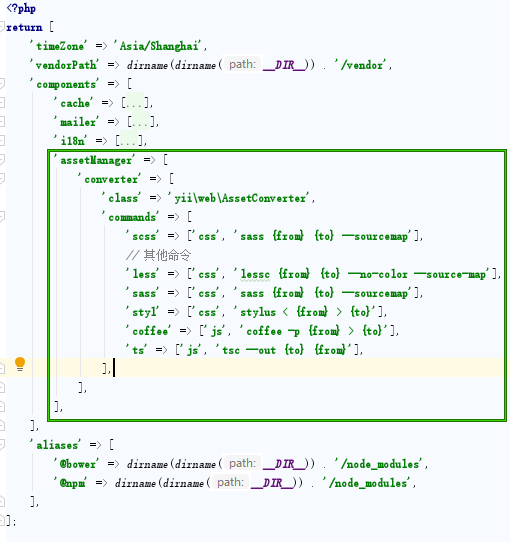

# Yii2 中使用ts

在运行环境 vagrant Ubuntu box 中安装 sass ,typescript等 


安装需要的软件:

````
sudo su -c "gem install sass" # 可选,安裝sass
sudo su -c "npm install -g typescript" # 可选,ts命令
sudo su -c "npm install -g less" # 可选,less命令
sudo su -c "npm install stylus -g" # 可选,stylus命令
sudo su -c "npm install -g coffee-script" # 可选,coffee命令
```

上面的 `npm`命令依赖 系统已安装好`ruby`, `node` 

> 上面的gem,npm命令在 windows的cmd中可以运行的


使用的是 Advanced 模板，修改 `common/config/main.php`(如果是 Basic 模板，修改`config/web.php`文件)，在`components` 数组中添加 `assetManager`元素 配置


```
 'assetManager' => [
            'converter' => [
                'class' => 'yii\web\AssetConverter',
                'commands' => [
                    'scss' => ['css', 'sass {from} {to} --sourcemap'],
                    // 其他命令
                    'less' => ['css', 'lessc {from} {to} --no-color --source-map'],
                    'sass' => ['css', 'sass {from} {to} --sourcemap'],
                    'styl' => ['css', 'stylus < {from} > {to}'],
                    'coffee' => ['js', 'coffee -p {from} > {to}'],
                    'ts' => ['js', 'tsc --out {to} {from}'],
                ],
            ],
        ],
```

效果类似如下图:




在 AppAsset.php 中直接引入 ts,sass 文件

```
class AppAsset extends AssetBundle
{
    public $basePath = '@webroot';
    public $baseUrl = '@web';
 
    public $css = [
        'css/index.scss', // 引入 scss 文件
    ];
    public $js = [
        'js/index.ts', //引入 ts 文件
    ];
    // 其他内容...
}
```

index.ts 示范内容

```
let myName = "hello";
```

最后网页自动导入的是 index.js，装换的内容是:

```
var myName = "hello";
```


当编辑 上面的 `index.css` 或者 `index.ts`，就会装换为对应的 css 或者 js 文件了.


##### References
1. [yii2](https://haobing.wang/yii2/)  清楚如何使用ts了
2. [5分钟上手TypeScript](https://www.tslang.cn/docs/handbook/typescript-in-5-minutes.html)
3. [Less 使用方法 安装](http://lesscss.cn/#using-less-installation)
4. [Get styling with Stylus](http://stylus-lang.com/#get-styling-with-stylus)
5. [CoffeeScript 中文](http://coffee-script.org/)
6. [Yii2-资源管理（Assets）](https://blog.csdn.net/xmlife/article/details/45696459) 使用资源转换器

