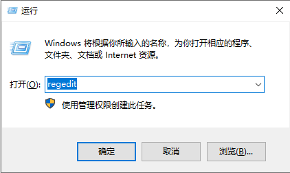
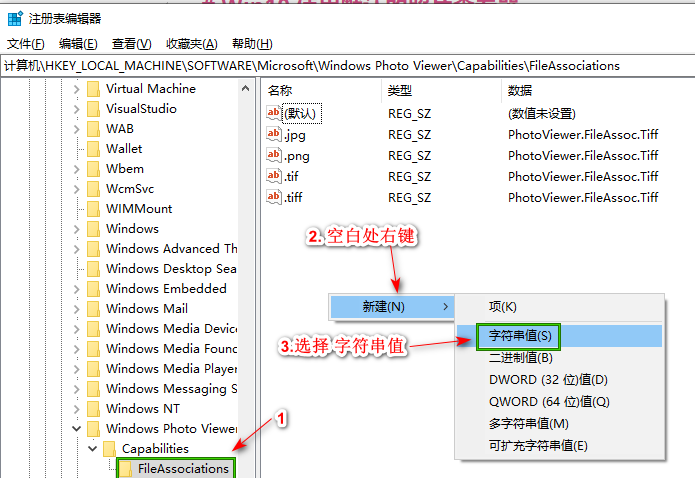
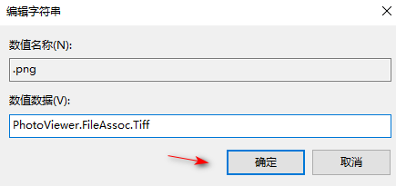
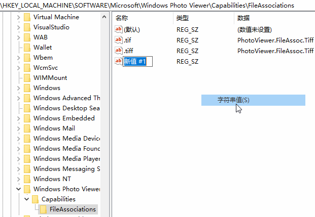

# Win10 使用默认的照片查看器

在打开图片的时候默认是 画图，我们想要用windows图片器打开，但是更多应用里面没有这一选项，
1. 按 Windows徽标键+R键，打开运行命令窗口，输入“regedit”命令 来打开 注册表编辑器

2. 在打开的 注册表编辑器，双击左侧的目录，依次打开 `HKEY_LOCAL_MACHINE\SOFTWARE\Microsoft\Windows Photo Viewer\Capabilities\FileAssociations` 目录项

FileAssociations目录下，我们对着该界面击右键，选择“新建-字符串值”菜单，如上图所示。

3. 如果你想要打开.jpg后缀的文件，
数值名称要写为 `.jpg`，
数值数据写为`PhotoViewer.FileAssoc.Tiff`
如下图所示，然后点击“确定”按钮。

`.png` 图片和`.jpg`的操作是一样的，只是数值名称不同。

操作演示:

注：修改数值名称，鼠标在 右侧的空白处单击或者敲`Enter`键都是确认修改数值名称了

##### References
1. [电脑的Windows图片查看器找不到怎么办](https://blog.csdn.net/qq_37003062/article/details/80297670)

