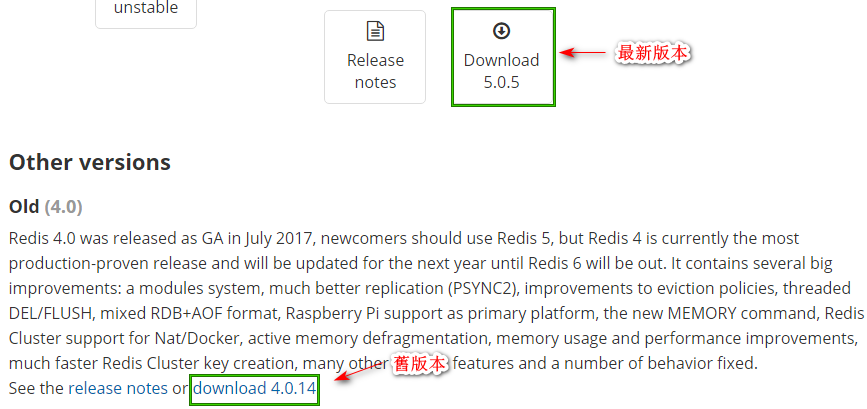
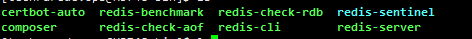

Centos 安装 LAMP

系统: Centos 6.5
Apache 2.4 + PHP 7.2 + Mysql 5.7

## 准备工作

1. centos 查看版本

查看 centos版本 [How to Check CentOS Version](https://www.thegeekdiary.com/how-to-check-centos-version/)

```
cat /etc/redhat-release
cat /etc/centos-release
cat /etc/os-release
```

2. 更新yum 源

```
[vagrant@centos tmp]$ sudo yum update
```

## 使用yum安装 Apache

```
[vagrant@centos tmp]$ sudo yum install httpd
```

## 安装好查看版本

```
[vagrant@centos tmp]$ httpd -v
Server version: Apache/2.2.15 (Unix)
Server built:   Jun 19 2018 15:45:13
```

## 开启 apache 自启动

```
[vagrant@centos tmp]$ sudo chkconfig httpd on
```
## Apahce 相关命令

```
sudo service httpd start #启动apache
sudo service httpd stop # 禁用apache
sudo service httpd restart # 重启apache
sudo apachectl configtest #测试配置文件的语法是否正确
```

## 开放 Apache 常用的 80,443端口

开放Apache的 `80`,`443` 端口

执行命令:

```
sudo /sbin/iptables -I INPUT -p tcp --dport 80 -j ACCEPT
sudo /sbin/iptables -I INPUT -p tcp --dport 443 -j ACCEPT
```
保存之前输入已开放端口号语句的命令

```
sudo /etc/rc.d/init.d/iptables save
```

查看打开端口命令

```
sudo service iptables status 
```

```
sudo service iptables restart #重启 iptables命令
```

## 配置 Apache 配置文件

编辑 `/etc/httpd/conf/httpd.conf`，禁止列出文件目录，访问`.env`(Laravel的配置文件)格式的文件

执行命令:

```
sudo vim /etc/httpd/conf/httpd.conf
```


找到 `<Directory "/var/www/html"`,将 `Options Indexes FollowSymLinks`改为 `Options FollowSymLinks`,禁止列出文件目录

在当前组的 `</Directory>` 之前添加

```
<Files .env>
    Order allow,deny
    Deny from all
</Files>
```
禁止访问`.env`文件

最后`httpd.conf`中`<Directory "/var/www/html">`节点的所有内容类似

```
#
# This should be changed to whatever you set DocumentRoot to.
#
<Directory "/var/www/html">
    Options FollowSymLinks
    AllowOverride All
    Order allow,deny
    Allow from all
<Files .env>
    Order allow,deny
    Deny from all
</Files>
</Directory>
```

---

```
[vagrant@centos tmp]$ apachectl configtest
httpd: apr_sockaddr_info_get() failed for centos
httpd: Could not reliably determine the server's fully qualified domain name, using 127.0.0.1 for ServerName
Syntax OK
```
如果出现`apr_sockaddr_info_get()`的错误，

1. 确认`etc/sysconfig/network`设定的值


```
$ cat /etc/sysconfig/network
NETWORKING=yes
HOSTNAME=centos
```

2. `/etc/hosts`追加

```
127.0.0.1   localhost localhost.localdomain localhost4 localhost4.localdomain4 centos
::1         localhost localhost.localdomain localhost6 localhost6.localdomain6
```

3. `/etc/httpd/conf/httpd.conf` 修改

```
#ServerName www.example.com:80
ServerName centos:80
```


## 安装 Mysql 5.7

### 更新及安装 mysql 的 yum 源

1. 官网下载源码包

```
[vagrant@centos tmp]$ wget http://dev.mysql.com/get/mysql57-community-release-el6-7.noarch.rpm
```

2. rpm 安装 mysql 的 yum 源

```
[vagrant@centos tmp]$ sudo rpm -Uvh mysql57-community-release-el6-7.noarch.rpm
```

3. 打开 `mysql-community.repo` 文件，查看关于 mysql 的内容，确定 `[mysql57-community]` 的 `enable`的值是`1` 

```
[vagrant@centos tmp]$ sudo vim /etc/yum.repos.d/mysql-community.repo
```

### 安装 Mysql

执行安装 mysql 命令

```
[vagrant@centos tmp]$ sudo yum install mysql-community-server
```
安装时，会出现2次确认，都输入`y`, 按`Enter`键确认即可

完成后启动服务

```
[vagrant@centos tmp]$ sudo service mysqld start
```

启动完成后，查看临时给`root`用户生成的密码

```
$ sudo grep "password" /var/log/mysqld.log
2018-08-08T02:59:58.687152Z 1 [Note] A temporary password is generated for root@localhost: 3fF4?tujHrfl
2018-08-08T03:00:04.204111Z 2 [Note] Access denied for user 'UNKNOWN_MYSQL_USER'@'localhost' (using password: NO)
```

第一行 ` root@localhost: 3fF4?tujHrfl` 这个就是数据库的 root 密码了

### 修改初始化密码

为了Mysql安全，建议修改 root的初始密码

执行命令:

```
[vagrant@centos tmp]$ sudo mysql_secure_installation
```

1. 执行上面的命令之后，需要先输入 `root`临时生成的密码，上一步查询到
2. 输入`root`目前的密码之后，需要输入2次新的root密码
3. `Change the password for root ? ((Press y|Y for Yes, any other key for No) : ` 回复 `y`来确认修改 `root`用户的密码
4. `Do you wish to continue with the password provided?(Press y|Y for Yes, any other key for No) : `  回复`y`来继续下面的步骤
5. `Remove anonymous users? (Press y|Y for Yes, any other key for No):` 回复 `y`来移除匿名用户(在生成环境下，你应该删除它)
6. `Disallow root login remotely? (Press y|Y for Yes, any other key for No) : ` 回复`y`来禁用 `root` 远程登录
7. `Remove test database and access to it? (Press y|Y for Yes, any other key for No) : ` 回复`y`来移除测试数据库
8. `Reload privilege tables now? (Press y|Y for Yes, any other key for No) : ` 回复`y`来重新加载权限


mysql 的配置文件默认在 `/etc/my.cnf`

###  开启Mysql 自启动

```
[vagrant@centos tmp]$ sudo chkconfig mysqld on
```

## 安装 PHP 7.2

如果之前已经安装过 php 的话,需要先卸载

```
[vagrant@centos tmp]$ sudo yum  remove php* php-common
```

### 更新及安装 PHP 的 yum 源


```
[vagrant@centos tmp]$ rpm -Uvh http://rpms.famillecollet.com/enterprise/remi-release-6.rpm
```

####  修改 yum 源

执行命令:

```
#安装第三方源epel-release
[vagrant@centos tmp]$ sudo yum install epel-release
[vagrant@centos tmp]$ sudo vi /etc/yum.repos.d/remi.repo
```

将 `[remi]` 节点下的 `enabled`的值由`0` 改为 `1`。

列出 `/etc/yum.repos.d`文件夹下的文件列表

```
[vagrant@centos tmp]$ ls -l /etc/yum.repos.d
CentOS-Base.repo       CentOS-fasttrack.repo  CentOS-Vault.repo  epel-testing.repo     mysql-community-source.repo  remi-glpi92.repo  remi-glpi94.repo  remi-php70.repo  remi-php72.repo  remi.repo
CentOS-Debuginfo.repo  CentOS-Media.repo      epel.repo          mysql-community.repo  remi-glpi91.repo             remi-glpi93.repo  remi-php54.repo   remi-php71.repo  remi-php73.repo  remi-safe.repo
```

通过上面的命令结果，可以按照自己需要安装的PHP版本，修改对应版本`remi-php<version>.repo`的文件

因为我需要安装的是 `7.2`版本，所以编辑的是 `remi-php72.repo`

执行命令: 
```
sudo vim /etc/yum.repos.d/remi-php72.repo
```

将 `[remi-php72]` 节点下的 `enabled`的值由`0` 改为 `1`。

```
yum list php
```
列出所有可安裝的软件php清单,如果显示的是 7.x 的话 就没有问题

#### 开始安装 php

```
sudo yum install php php-cli php-curl php-json php-pdo php-mysql php-gd php-bcmath php-xml php-mbstring php-mcrypt php-redis php-crypto
```
安装途中，会出现多次确认，输入`y`并按`Enter`键 确认 安装

安装完成之后，可以通过`php -v`查看 php 版本 或`php -m` 查看安装的扩展


## 配置PHP

配置文件默认是在`/etc/php.ini`


```
date.timezone = Asia/Shanghai
upload_max_filesize = 20M
post_max_size = 20M
#生成环境需关掉显示错误信息
display_errors = Off
# 在HTTP返回头不显示 PHP 信息
expose_php = Off 
```

## 安装Composer

按照 [Command-line installation](https://getcomposer.org/download/) 命令进行安装
```
cd /tmp
php -r "copy('https://getcomposer.org/installer', 'composer-setup.php');"
# 如果安装的版本不一样，sha384会验证失败的情况
php -r "if (hash_file('sha384', 'composer-setup.php') === '48e3236262b34d30969dca3c37281b3b4bbe3221bda826ac6a9a62d6444cdb0dcd0615698a5cbe587c3f0fe57a54d8f5') { echo 'Installer verified'; } else { echo 'Installer corrupt'; unlink('composer-setup.php'); } echo PHP_EOL;"

php composer-setup.php

php -r "unlink('composer-setup.php');"
# 全局安装 composer
sudo mv composer.phar /usr/local/bin/composer
# 查看composer版本
composer -V
```

## Redis的安装(可选)


进入[Redis](https://redis.io/download) ,需要不同的版本，可以在官网页面中进行选择



上图框住的部分，鼠标放上去可以看到链接，鼠标在下载链接上右键，选择"复制链接地址(E)"(Chrome浏览器的右键菜单选项)

1. 下载 安装包

```
wget http://download.redis.io/releases/redis-4.0.14.tar.gz
```

2. 解压和安装

```
tar -xzf redis-4.0.14.tar.gz
cd redis-4.0.14
sudo make
sudo make install
```
> Redis没有其他外部依赖，安装过程很简单。编译后在Redis源代码目录的src文件夹中可以找到若干个可执行程序，安装完后，在/usr/local/bin目录中可以找到刚刚安装的redis可执行文件。如下图



4. 启动 redis

直接执行 `redis-server` 命令就启动了

随开机启动脚本，在`/etc/init.d/`文件夹下创建一个`redis_端口号`的文件，如`redis_6379`

5. 创建文件夹

```
# 创建存放redis配置的文件夹
sudo mkdir -p /etc/redis
# 创建存放redis 数据的文件夹,端口号，默认是6379
sudo mkdir -p /var/redis/端口号
```

6. 修改配置文件

```
# 进入下载 redis-4.0.14.tar.gz 文件时的目录，复制文件配置模板到 /etc/redis,并重命名为`6379.conf`
sudo cp redis-4.0.14/redis.conf /etc/redis/6379.conf
```

> 首先将配置文件模板（redis-4.0.14/redis.conf）复制到/etc/redis 目录中，以端口号命名（如“6379.conf”），然后按照下表对其中的部分参数进行编辑。

| 参数 | 值 | 说明 |
| ------ | ------ | ------ |
| daemonize | yes | 使Redis以守护进程模式运行(由`no`改为`yes`) |
| pidfile | `/var/run/redis_端口号.pid` | 设置Redis的PID文件位置(默认已是`/var/run/redis_6379.pid`，不用修改) |
| port | 端口号 | 设置Redis监听的端口号(默认是6379,不用修改) |
| dir | `/var/redis/端口号` | 设置持久化文件存放位置，默认是`dir ./`，修改为`/var/redis/6379` |

7. 创建 `/etc/init.d/redis_6379` 文件并进行配置

```
sudo vim /etc/init.d/redis_6379
```

在vim编辑器中填入以下内容

```
#!/bin/bash
# /etc/init.d/redis_6379

### BEGIN INIT INFO
# Provides: redis_6379
# Required-Start: $remote_fs $syslog
# Required-Stop: $remote_fs $syslog
# Default-Start: 2 3 4 5
# Default-Stop: 0 1 6
# Short-Description: redis server script
# Description: This service is used to manage redis-server start or stop
### END INIT INFO

REDISPORT=6379
EXEC=/usr/local/bin/redis-server
CLIEXEC=/usr/local/bin/redis-cli

PIDFILE=/var/run/redis_${REDISPORT}.pid
CONF="/etc/redis/${REDISPORT}.conf"

case "$1" in
     start)
          if [ -f $PIDFILE ];
          then
              echo "$PIDFILE exists,redis-server is already running or crashed"
          else
              echo "Starting Redis Server"
              $EXEC $CONF
          fi
        ;;
     stop)
        echo "Stopping Redis Server"
        #killall redis server
        kill $(ps aux | grep -m 1 "${EXEC}" | awk '{ print $2 }')
        ;;
     *)
         echo "Usage: service redis_6379 start|stop"
         exit 1
        ;;
esac
exit 0
```

保存之后，就可以通过以下命令来启动或者停止 redis-server 了

```
# 启动redis server
sudo service redis_6379 start
# 停止redis server
sudo service redis_6379 stop
```

8. 启用redis-server开机启动

```
sudo chkconfig redis_6379 on
```

列出redis的启动信息

```
chkconfig --list | grep "redis"
```
如果列表中出现了

```
redis_6379     	0:off	1:off	2:on	3:on	4:on	5:on	6:off
```

说明开机启动设置成功了


## 部署Laravel到生成环境的优化

安装包

```
composer install --optimize-autoloader --no-dev
```
> 其中，`--optimize-autoloader` 表示生成优化后的自动加载器，虽然生成过程可能较慢，但换来的是提高运行时的效率。`--no-dev` 表示不安装 composer.json 中 require-dev 声明的扩展包，在生产环境中我们不需要这些开发依赖。

建立缓存
```
php artisan optimize
php artisan api:cache
php artisan route:cache
php artisan view:clear
php artisan config:cache
```

## supervisor (可选)

因为 Centos 6.5 通过Yum 安装的 supervisor 的版本是 `2.1`

可以通过`yum info supervisor` 查询`supervisor`的信息

如果已通过 yum 命令安装了`supervisor` 2.1,可以通过`yum remove supervisor*`来卸载。


### 安装 supervisor

```
# 查看python版本
[vagrant@centos tmp]$  python -V
Python 2.6.6
```

指定安装supervisor 3.1.3版本，这个版本可以用python2.6，直接装了就能用。可以`pip install supervisor==3.1.3`或者`easy_install supervisor==3.1.3`

我是通过下面安装的:

```
easy_install supervisor==3.1.3
```

### 配置

1. 生成配置文件

```
echo_supervisord_conf > /etc/supervisord.conf
```

2. 编辑配置文件

```
sudo vim /etc/supervisord.conf
```

找到
```
;[include]
;files = relative/directory/*.ini
```

改为

```
[include]
;files = relative/directory/*.ini
files = /etc/supervisor/conf.d/*.conf
```

保存之后，创建包含的目录

```
sudo mkdir -p /etc/supervisor/conf.d
```

以后工作的配置文件就可以放在这个目录里了

3. 启动supervisord

使用 `/etc/supervisord.conf` 配置文件来启动`supervisord` 服务
```
/usr/bin/supervisord -c /etc/supervisord.conf
```

4. 常用的命令小记

```
#查看状态
supervisorctl status
# 添加或者修改了配置文件，需要重新加载
supervisorctl reload
# 重启所有
supervisorctl restart all
```


## 遇见的问题

### Apache error: _default_ virtualhost overlap on port 443或者80

 `Apache error: _default_ virtualhost overlap on port 443或者80`,修改 `httpd.conf`文件，大概在 1002行左右添加

```
NameVirtualHost *:80
#如果需要使用到https,需要添加 443端口
NameVirtualHost *:443 
```

### You don't have permission to access /index.html on this server.

当确认了 `DocumentRoot` 如`/home/testdomain/public_html`三级文件夹和`index.html`的权限都是 755(drwxrwxr-x)之后，访问还是 `You don't have permission to access /index.html on this server.`

可以检查Centos的`selinux`状态，尝试关闭SELinux访问之后，应该就可以访问到

#### 查看 SELinux状态

```
[vagrant@centos tmp]$ getenforce
Enforcing #是启用的，如果返回Disabled，就是已经禁用了
```
#### 临时关闭

```
sudo setenforce 0
```
#### 永久关闭

`vi /etc/selinux/config`

将`SELINUX=enforcing`改为`SELINUX=disabled `
设置后需要重启才能生效


##### References

1. [CentOS6.5 下升级 PHP7、MySQL5.7](https://laravel-china.org/topics/2289/centos65-upgrade-php7-mysql57) 文章安装部分文字描述主要参考
1. [centos 6.5 防火墙开放指定端口](https://www.cnblogs.com/tiandi/p/10152775.html) 简单快速设置好  iptables
2. [Centos查看端口占用情况和开启端口命令](https://www.centos.bz/2018/03/centos%E6%9F%A5%E7%9C%8B%E7%AB%AF%E5%8F%A3%E5%8D%A0%E7%94%A8%E6%83%85%E5%86%B5%E5%92%8C%E5%BC%80%E5%90%AF%E7%AB%AF%E5%8F%A3%E5%91%BD%E4%BB%A4/) 开放端口的内容规则，但是新增的规则一定要放在`-A FORWARD`开头这1行的前面，不然重启 iptables 不会生效
3. [CentOS / httpd > Starting httpd: httpd: apr_sockaddr_info_get() failed for [hostname].localdomain](https://qiita.com/7of9/items/a8f856653591dbf73f42) centos httpd 重啓顯示 `httpd: apr_sockaddr_info_get() failed for`的解决参考
4. [CentOS 7.X 关闭SELinux](https://www.cnblogs.com/activiti/p/7552677.html) SELinux关闭参考
5. [CentOS下Redis的安装](https://www.cnblogs.com/renzhicai/p/7773080.html) redis 安装参考
6. [linux chkconfig 使用说明](https://www.cnblogs.com/lfxiao/p/9528187.html) 了解chkconfig使用很有帮助
7. [（上线时清缓存）laravel 5.1 的程序性能优化(配置文件) - 简书](https://www.cnblogs.com/wzjwffg/p/9882696.html) 和 [轻松部署 Laravel 应用 | 《10. 手动部署 - 生产环境的必要优化》](https://learnku.com/articles/25752)
8. [centos6.5安装supervisor](https://www.cnblogs.com/xiaxiaosheng/p/10937740.html) Centos 6.5下安装 supervisor 3 的解决方法和[centos下安装supervisor的步骤详解](https://www.php.cn/linux-413808.html) 很详细